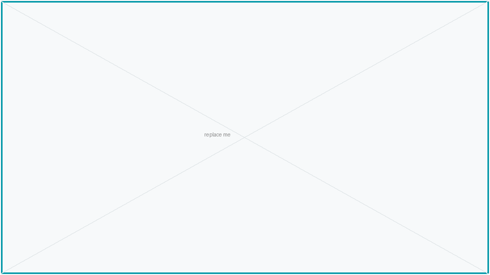

---
# Copy this directory to decks/lecture-XX/, change the three values marked
# CHANGE ME, then add the deck to decks.config.json.
#
# This directory is not in decks.config.json, so nothing here is ever built or
# published — it exists only to be copied.
theme: dl2026
addons:
  - dl2026
title: Lecture title                                    # CHANGE ME
info: PGR207 Deep Learning 2026 — Lecture XX
author: Vajira Thambawita
routerMode: hash
transition: slide-left
mdc: true
themeConfig:
  courseCode: PGR207
  lecture: "XX"                                         # CHANGE ME
  lectureTitle: Lecture title                           # CHANGE ME
layout: title
courseCode: PGR207
lecture: "XX"
email: vajira@simula.no
---

# Lecture title

One sentence saying what the room will be able to do by the end.

<!--
Speaker notes go in HTML comments. They show in the presenter view and are
stripped from anything published.
-->

---
layout: section
index: "01"
---

# First section

---
layout: default
title: A content slide
---

# A content slide

<v-clicks>

- One idea per bullet
- Revealed one at a time
- Maths is native: $z = \mathbf{w}^\top\mathbf{x} + b$

</v-clicks>

<div v-click class="mt-6 dl-callout">
Use a callout for the point you want the room to leave with.
</div>

---
layout: default
title: Two columns
---

# Two columns

<!--
Prefer this over Slidev's built-in two-cols layouts: only the theme's own
layouts carry the course footer.
-->

<div class="grid grid-cols-2 gap-10 mt-2">
<div>

Left column.

</div>
<div>

Right column.

</div>
</div>

---
layout: figure
title: A figure
---



::caption::

What the figure shows, and why it is on this slide.

::citation::

<Citation source="Where it came from" url="https://example.org" />

---
layout: interactive
title: An interactive slide
aside-width: 17rem
---

<ActivationExplorer />

::aside::

The prose rail. Say what the widget is for and what to try — a widget rarely
explains itself.

---
layout: default
title: Code
---

# Code

```python {all|1-2|4-5|all}{lines:true}
import numpy as np

def net_input(X, w, b):
    return X @ w + b
```

---
layout: end
email: vajira@simula.no
next: The next lecture
---

# To be continued…
