# Deep Learning

Twelve weeks, from a single artificial neuron to deep reinforcement learning.

<!--
Welcome. Before anything else: check who is in the room, agree how we
communicate, and pick class representatives — those decisions are easier now
than in week 6.
-->

---
layout: section
index: "01"
---

# Introduction to Deep Learning

---
layout: default
title: Who am I?
---

# Who am I?

  

    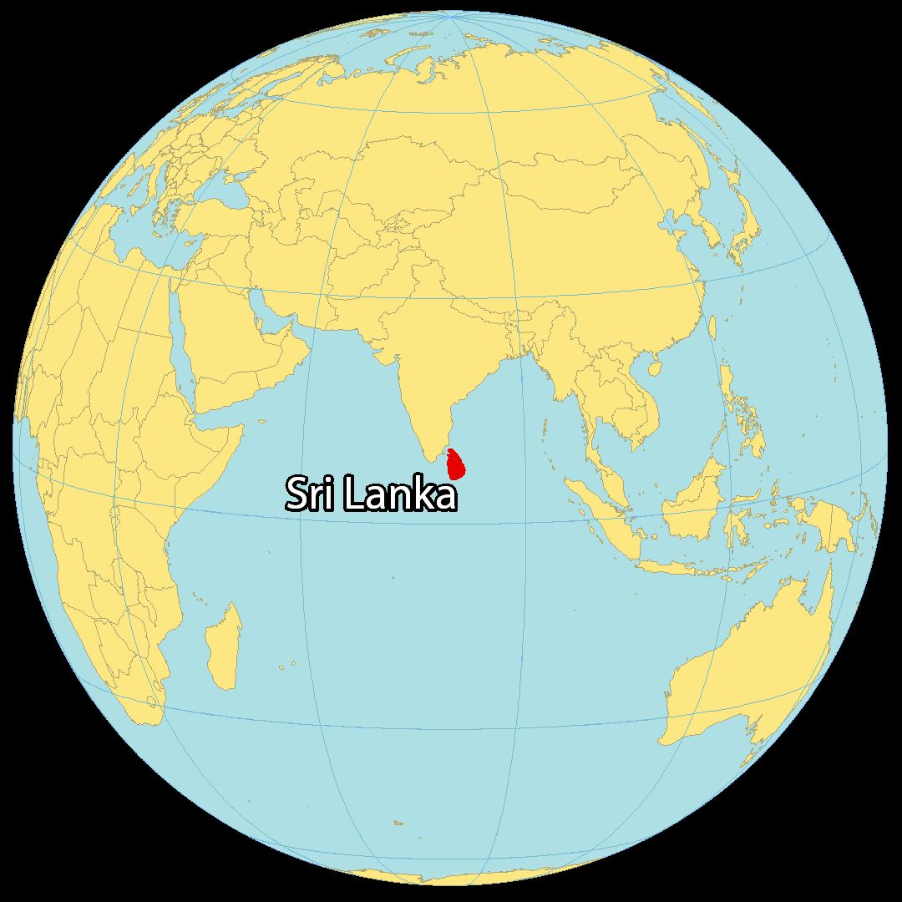
    
From Sri Lanka

  

  

    
    
…which looks like this

  

  

    
    
Now a researcher at SimulaMet, Oslo

  

  

    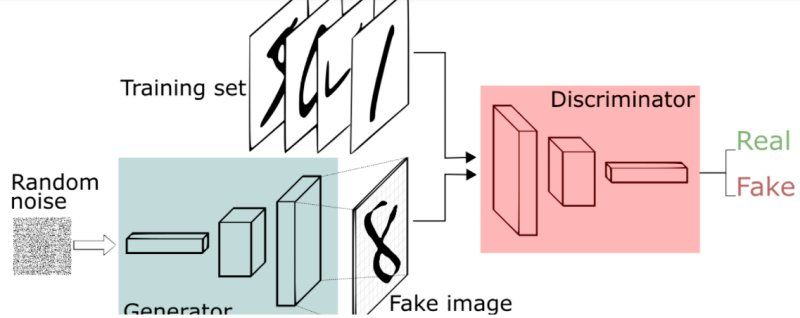
    
I work on generative models…

  

  

    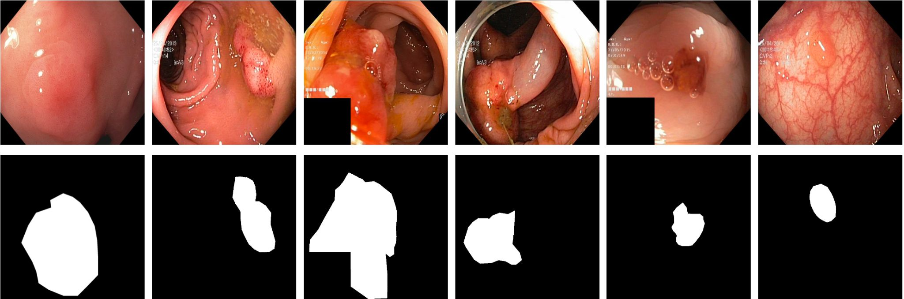
    
…for endoscopy

  

  

    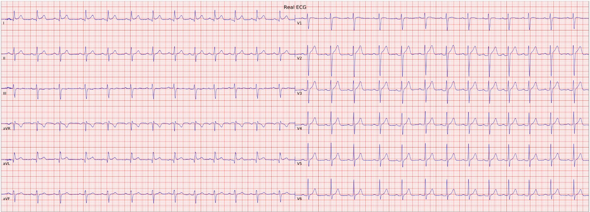
    
…and for physiological signals

  

<!--
Week 8-9 covers GANs. Everything on the bottom row of this slide is built out
of what we learn then.
-->

---

<PollSlide
  question="Who are you?"
  :items="[
    'What level are you studying at?',
    'What do you already know about machine learning?',
    'How much time can you give this course?',
    'What hardware and resources do you have?',
    'How should we communicate?'
  ]"
/>

<!--
Do not rush this. The answers change how fast we move through weeks 3 to 5.
-->

---
layout: default
title: Class representatives
---

# Class representatives

<v-clicks>

- One or two?
- One female and one male?
- Names?
- Email addresses?

</v-clicks>

Representatives are the channel for anything that affects the whole group —
deadlines, pace, room changes.

---
layout: default
title: Outline
---

# Outline

<v-clicks>

- Introduction to course content
- Course evaluation method, and exams
- What is deep learning?
- Application of deep learning

</v-clicks>

<v-clicks>

- Deep learning frameworks
- Installing a deep learning framework
- Google Colab and Kaggle
- Jupyter notebooks

</v-clicks>

---
layout: section
index: "02"
---

# Introduction to course content

---
layout: default
title: Workload
---

# Workload

### Where the 200 hours go

<v-clicks>

- **48 h** — lectures and exercises (12 weeks × 4 h)
- **72 h** — self-study
- **80 h** — exam preparation and execution

</v-clicks>

### Evaluation

<v-clicks>

- **Individual project** — mandatory 
  paper + code (notebooks)
- **Final group project**, 2–3 people — mandatory 
  draft paper (report) + code (notebooks)
- Grades **A–F**

</v-clicks>

<!--
The two projects are where the grade comes from. Start thinking about groups
early — by week 8 the good pairings are already taken.
-->

---
layout: default
title: References
---

# References

<v-clicks>

- Raschka, Liu & Mirjalili — ***Machine Learning with PyTorch and Scikit-Learn*** 
  The main reference. We use it from Chapter 11 onwards.
- Ashish Ranjan Jha — ***Mastering PyTorch***
- [pytorch.org](https://pytorch.org/) — the framework, and its documentation

</v-clicks>

---
layout: default
title: What we will learn
---

# What we will learn

<SyllabusTimeline class="mt-2" />

<!--
Click any block to see what it covers. Weeks 4-5 and 8-9 are the two heavy
blocks; the projects usually grow out of one of them.
-->

---
layout: section
index: "03"
---

# What is deep learning?

---
layout: default
title: What do you think about these photos?
---

# What do you think about these photos?

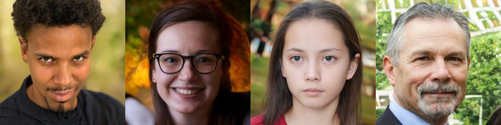

  Not one of these people exists.

Every face was generated by a network trained on photographs — the same family
of models we build in weeks 8 and 9.

<!--
Ask before clicking. Someone always spots the ears or the background.
-->

---
layout: default
title: From a sentence to an image
---

# From a sentence to an image

  
"A brain riding a rocket ship heading towards the moon."

  

  
"A dragon fruit wearing a karate belt in the snow."

  

  <Citation source="Prompts and images: Google Imagen" url="https://imagen.research.google/" />

<!--
Read the prompts out first and let the room picture them. Neither of these
combinations exists in any training set.
-->

---
layout: figure
title: Large language models
---

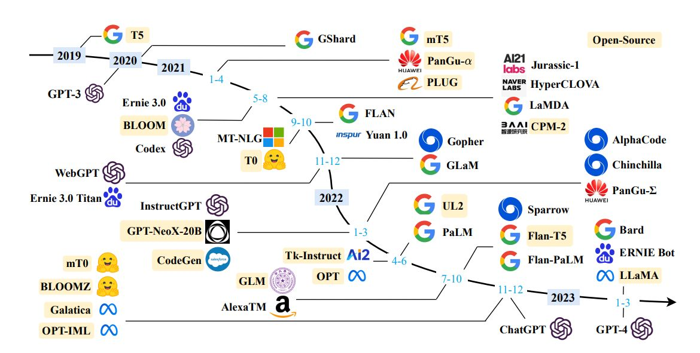

::caption::

Five years of large language models. Almost everything here is a **transformer** — which we cover in week 7.

::citation::

<Citation source="Yang et al., Harnessing the Power of LLMs in Practice" url="https://arxiv.org/abs/2304.13712" />

---
layout: interactive
title: Try them yourself
---

  <LinkCard href="https://openai.com/index/dall-e-3/" title="DALL·E 3" blurb="Text to image." icon="🎨" />
  <LinkCard href="https://pytorch.org/" title="PyTorch" blurb="The framework we use all semester." icon="🔥" />

::aside::

Live demos beat screenshots. If the network is cooperating, generate something
the room suggests.

---
layout: default
title: Can we use DL knowledge to earn money?
---

# Can we use DL knowledge to earn money?

(in addition to doing a job in this path)

  <LinkCard v-click href="https://www.kaggle.com/" title="Kaggle" blurb="Competitions, datasets, and free GPU notebooks." icon="🏆" />
  <LinkCard v-click href="https://grand-challenge.org/challenges/" title="Grand Challenge" blurb="Medical imaging challenges." icon="🩺" />
  <LinkCard v-click href="https://www.aicrowd.com/" title="AIcrowd" blurb="Open research challenges." icon="🧩" />
  <LinkCard v-click href="https://www.topcoder.com/" title="Topcoder" blurb="Freelance and competitive work." icon="💼" />

<!--
Six slides in the 2025 deck were a single bare URL each. A Kaggle notebook is
also a perfectly good individual-project artefact.
-->

---
layout: interactive
title: Definition of deep learning
aside-width: 20rem
---

<AIMLDLVenn />

::aside::

> Deep learning is a subset of machine learning, which is essentially a neural
> network with three or more layers. These neural networks attempt to simulate
> the behavior of the human brain — allowing it to "learn" from large amounts
> of data.

<Citation source="IBM Cloud Learn Hub" url="https://www.ibm.com/topics/deep-learning" />

---
layout: interactive
title: Three different types of machine learning
aside-width: 15rem
---

<MLTypes />

::aside::

This course is mostly **supervised**, with generative models in weeks 8–9 and
reinforcement learning in weeks 11–12.

<Citation source="After Raschka, Liu & Mirjalili, ch. 1" />

---
layout: section
index: "04"
---

# Application of deep learning

---
layout: default
title: Some applications of DL
---

# Some applications of DL

<v-clicks>

- Computer vision
- Natural language processing
- Self-driving cars (more than computer vision)
- Healthcare
- Entertainment
- Composing music
- Robotics
- Fraud detection
- E-commerce

</v-clicks>

  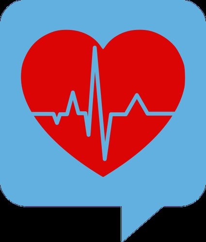
  
  
  

---
layout: interactive
title: Computer vision categories
aside-width: 14rem
---

<FigureSpotlight
  :regions="[
    { x: 0, y: 0, w: 19, h: 100, label: 'Classification', note: 'One label for the whole image. Single object.' },
    { x: 19.5, y: 0, w: 19, h: 100, label: 'Semantic segmentation', note: 'A class for every pixel. No object instances at all.' },
    { x: 39.5, y: 0, w: 19.5, h: 100, label: 'Classification + localisation', note: 'One label plus one box. Still a single object.' },
    { x: 59.5, y: 0, w: 19.5, h: 100, label: 'Object detection', note: 'A label and a box per object. Multiple objects.' },
    { x: 80, y: 0, w: 20, h: 100, label: 'Instance segmentation', note: 'Per-pixel classes, separated per object.' },
  ]"
>
  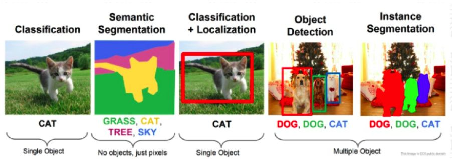
</FigureSpotlight>

::aside::

Telling these four apart is the week 4–5 objective.

<Citation source="Figure: CS231n (CC0)" />

---
layout: section
index: "05"
---

# Our projects

---
layout: figure
title: Synthetic polyp generation
---

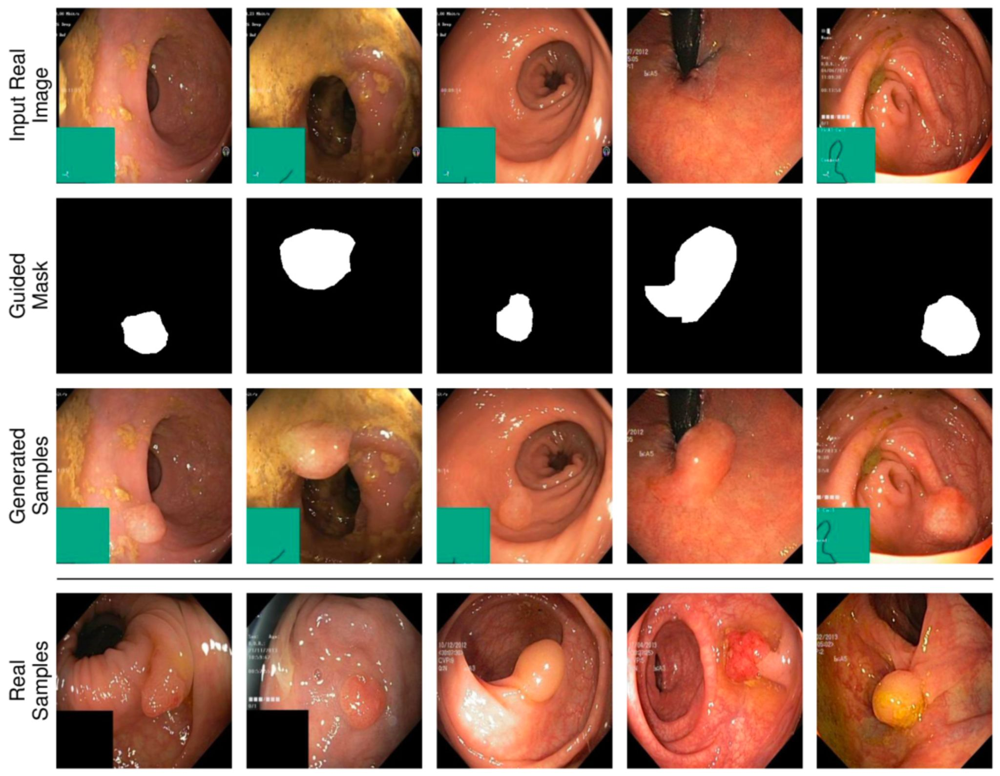

::caption::

Generating endoscopy images **and** their segmentation masks, to train detection models where real annotated data is scarce.

---
layout: figure
title: Synthetic ECG
---

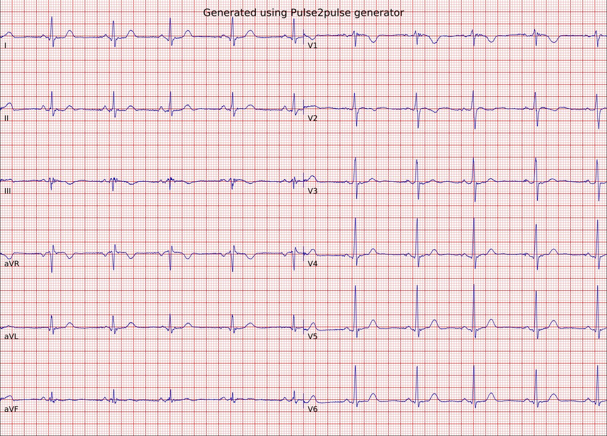

::caption::

The same idea applied to physiological signals: synthetic twelve-lead ECGs that keep the clinical structure of the real thing.

---
layout: default
title: The main pipeline
---

# The main pipeline

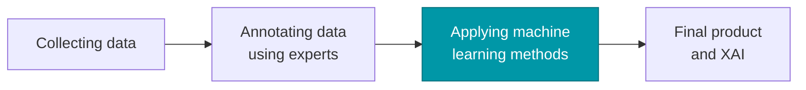

  <strong>We learn this step.</strong> The other three are where most of the real
  effort goes — and the reason a good dataset is worth more than a clever model.

---
layout: interactive
title: Collecting data is its own pipeline
aside-width: 0rem
---

<CycleDiagram />

<!--
This is the loop behind "collecting data" on the previous slide. Ethical
approval alone can take months.
-->

---
layout: section
index: "06"
---

# Deep learning frameworks

---
layout: default
title: Frameworks
---

# Frameworks

  <LinkCard v-click href="https://pytorch.org/" title="PyTorch" blurb="What we use all semester." icon="🔥" />
  <LinkCard v-click href="https://www.tensorflow.org/" title="TensorFlow" blurb="Google's framework, with Keras on top." icon="🧱" />
  <LinkCard v-click href="https://www.dgl.ai/" title="DGL" blurb="Graph neural networks — week 10." icon="🕸" />
  <LinkCard v-click href="https://www.paddlepaddle.org.cn/en" title="PaddlePaddle" blurb="Baidu's framework." icon="🌊" />
  <LinkCard v-click href="https://mxnet.apache.org/" title="MXNet" blurb="Apache, now retired but still in papers." icon="📦" />
  <LinkCard v-click href="https://www.mathworks.com/products/deep-learning.html" title="MATLAB" blurb="Common in engineering departments." icon="📐" />

They all express the same maths. We pick one so the exercises are comparable.

---
layout: default
title: Hardware
---

# Hardware

  <h3>CPU</h3>
  
Fine for small models and all the data work. Not for training.

  
Intel · AMD · Apple · Qualcomm · Samsung · IBM

  <h3>GPU</h3>
  
What we actually train on. Thousands of cores doing the same matrix multiply.

  
NVIDIA · AMD · Broadcom · Imagination

  <h3>TPU</h3>
  
Built only for tensor maths. Free ones on Colab, and in edge devices.

  
Google · Coral · Hailo · Graphcore

  You do <strong>not</strong> need to own a GPU for this course. Colab and Kaggle both
  give you one for free.

---
layout: end
email: vajira@simula.no
next: Basics of Neural Networks
---

# Practical session — Week 1
