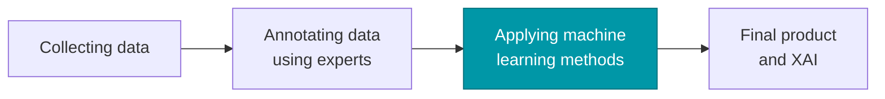

# Deep Learning

Twelve weeks, from a single artificial neuron to deep reinforcement learning.

<!--
Welcome. Before anything else: check who is in the room, agree how we
communicate, and pick class representatives — those decisions are easier now
than in week 6.
-->

---
layout: section
index: "01"
---

# Introduction to Deep Learning

---
layout: default
title: Who am I?
---

# Who am I?

  

    
    
From Sri Lanka

  

  

    
    
…which looks like this

  

  

    
    
Now a researcher at SimulaMet, Oslo

  

  

    
    
I work on generative models…

  

  

    
    
…for endoscopy

  

  

    
    
…and for physiological signals

  

<!--
Weeks 9-10 cover GANs. Everything on the bottom row of this slide is built out
of what we learn then.
-->

---

<PollSlide
  question="Who are you?"
  :items="[
    'What level are you studying at?',
    'What do you already know about machine learning?',
    'How much time can you give this course?',
    'What hardware and resources do you have?',
    'How should we communicate?'
  ]"
/>

<!--
Do not rush this. The answers change how fast we move through weeks 3 to 5.
-->

---
layout: default
title: Class representatives
---

# Class representatives

<v-clicks>

- One or two?
- One female and one male?
- Names?
- Email addresses?

</v-clicks>

---
layout: default
title: Outline
---

# Outline

<v-clicks>

- Introduction to course content
- Course evaluation method, and exams
- What is deep learning?
- Application of deep learning

</v-clicks>

<v-clicks>

- Deep learning frameworks
- Installing a deep learning framework
- Google Colab and Kaggle
- Jupyter notebooks

</v-clicks>

---
layout: section
index: "02"
---

# Introduction to course content

---
layout: default
title: Workload
---

# Workload

### Where the 200 hours go

<v-clicks>

- **48 h** — lectures and exercises (12 weeks × 4 h)
- **72 h** — self-study
- **80 h** — exam preparation and execution

</v-clicks>

### Evaluation

<v-clicks>

- **Compulsory assignment** — group of 2–3 
  released in week 2 · **pass / fail**
- **Final assignment** — individual 
  released around week 6 · **graded A–F**
- You must **pass** the group assignment to sit the final one

</v-clicks>

<!--
The group assignment is pass or fail — it is the gate. The grade on the
transcript comes from the final individual assignment alone. Groups form in
week 2, so raise it now rather than later.
-->

---
layout: default
title: The two assignments
---

# The two assignments

<!--
Each card reveals whole. Do not wrap the bullets in <v-clicks> inside a
v-click card: Slidev numbers the children before their container, so the
bullets would be "revealed" while the card is still hidden and those clicks
would do nothing on screen.
-->

Released week 2

### Compulsory assignment

Groups of 2–3 students

Pass / fail

- A **full project**, not an exercise
- A **code repository**
- A corresponding **scientific paper**
- **Individual contributions** stated explicitly — who did what

Released around week 6

### Final assignment

Individual

Graded A–F

- Same structure as the compulsory assignment
- A **code repository**
- A corresponding **scientific paper**
- Everything is your own work

Both are mandatory. The group assignment is the <strong>gate</strong> — pass it to sit
the final, and only the final carries a letter grade.

<!--
Say it in this order: the group assignment is pass or fail and it is the
prerequisite; the final individual assignment is what gets the A-F grade.
Then say plainly what "individual contributions" means: the paper names who
did what, and the repository history should back it up. A shared repository
with an honest commit history does most of that work for you.
-->

---
layout: default
title: References
---

# References

<v-clicks>

- Raschka, Liu & Mirjalili — ***Machine Learning with PyTorch and Scikit-Learn*** 
  The main reference. We use it from Chapter 11 onwards.
- Ashish Ranjan Jha — ***Mastering PyTorch***
- [pytorch.org](https://pytorch.org/) — the framework, and its documentation

</v-clicks>

<AssistantTiles v-click class="mt-4" />

<!--
The fourth reference is the one everybody already uses. Say the rule out loud:
assistants are allowed, and the assignments ask you to state where you used
one - what you cannot do is hand in code or text you cannot explain.
-->

---
layout: default
title: What we will learn
---

# What we will learn

<SyllabusTimeline class="mt-2" />

<!--
Click any block to see what it covers. Weeks 4-5 and 6-8 are the two heavy
blocks; the projects usually grow out of one of them.
-->

---
layout: section
index: "03"
---

# What is deep learning?

---
layout: default
title: What do you think about these photos?
---

# What do you think about these photos?

  Neither of these people exists.

<!--
Ask before clicking. Someone always spots the ears or the background.
-->

---
layout: default
title: From a sentence to an image — or a video
---

# From a sentence to an image — or a video

"A dragon fruit wearing a karate belt in the snow." — one sentence in, a picture
or two minutes of video out. Where that stands in August 2026:

<GenerativeFrontier class="mt-3" />

<!--
Read the prompt out first and let the room picture it: no photograph of that
exists anywhere in a training set.

Two things worth saying out loud about this list. Google is the only one of the
three shipping across both rows - Anthropic ships no image or video generator
at all, because Claude reads images but does not draw them. And OpenAI's video
line is the cautionary tale: Sora 2 was state of the art and the product was
retired anyway, in March 2026, on cost. Capability and a viable product are
not the same thing.
-->

---
layout: interactive
title: Three years of language and multimodal models
aside-width: 15rem
---

<ModelLandscape />

::aside::

The lanes are **architectures**.

Nearly everything recent is **decoder-only**. Encoder-only moved into retrieval;
encoder–decoder is now a deliberate minority.

All of it is the **transformer** of week 7.

Open weights only.

<!--
Every model plotted here is open-weights with a paper you can read, and each
arXiv link was checked against arxiv.org.

Closed frontier models — GPT, Gemini, Claude — are deliberately absent. They
publish no paper to link and no verifiable release date, so putting them on a
timeline would be presenting guesses as fact. Mention them out loud; the point
of the slide is the architecture lanes, not the leaderboard.
-->

---
layout: default
title: Can we use DL knowledge to earn money?
---

# Can we use DL knowledge to earn money?

(in addition to doing a job in this path)

  <LinkCard v-click href="https://www.kaggle.com/" title="Kaggle" blurb="Competitions, datasets, and free GPU notebooks." icon="🏆" />
  <LinkCard v-click href="https://grand-challenge.org/challenges/" title="Grand Challenge" blurb="Medical imaging challenges." icon="🩺" />
  <LinkCard v-click href="https://www.aicrowd.com/" title="AIcrowd" blurb="Open research challenges." icon="🧩" />
  <LinkCard v-click href="https://www.topcoder.com/" title="Topcoder" blurb="Freelance and competitive work." icon="💼" />

<!--
Six slides in the 2025 deck were a single bare URL each. A Kaggle notebook is
also a perfectly good individual-project artefact.
-->

---
layout: interactive
title: Definition of deep learning
aside-width: 20rem
---

<AIMLDLVenn />

::aside::

> Deep learning is a subset of machine learning, which is essentially a neural
> network with three or more layers. These neural networks attempt to simulate
> the behavior of the human brain — allowing it to "learn" from large amounts
> of data.

<Citation source="IBM Cloud Learn Hub" url="https://www.ibm.com/topics/deep-learning" />

---
layout: interactive
title: Three different types of machine learning
aside-width: 15rem
---

<MLTypes />

::aside::

This course is mostly **supervised**, with generative models in weeks 9–10 and
reinforcement learning in weeks 11–12.

<Citation source="After Raschka, Liu & Mirjalili, ch. 1" />

---
layout: section
index: "04"
---

# Application of deep learning

---
layout: default
title: Some applications of DL
clicks: 8
---

# Some applications of DL

<ApplicationGallery />

<!--
One category per press of space. The illustration reads input on the left,
output on the right — so each name lands as something a model actually does.
-->

---
layout: section
index: "05"
---

# Our projects

---
layout: figure
title: Synthetic polyp generation
---

::caption::

Generating endoscopy images **and** their segmentation masks, to train detection models where real annotated data is scarce.

---
layout: figure
title: Synthetic ECG
---

::caption::

The same idea applied to physiological signals: synthetic twelve-lead ECGs that keep the clinical structure of the real thing.

<a href="https://huggingface.co/spaces/SEARCH-IHI/deepfake-ecg-generator-plus" target="_blank" rel="noopener"><strong>Generate one yourself →</strong></a>

::citation::

huggingface.co/spaces/SEARCH-IHI/ deepfake-ecg-generator-plus

<!--
Open the Space live if the network allows it - it generates a full twelve-lead
ECG in the browser, and seeing it appear lands better than the figure does.
-->

---
layout: default
title: The main pipeline
---

# The main pipeline

  <strong>We learn this step.</strong> The other three are where most of the real
  effort goes — and the reason a good dataset is worth more than a clever model.

---
layout: interactive
title: Collecting data is its own pipeline
aside-width: 0rem
---

<CycleDiagram />

<!--
This is the loop behind "collecting data" on the previous slide. Ethical
approval alone can take months.
-->

---
layout: section
index: "06"
---

# Deep learning frameworks

---
layout: default
title: Frameworks
---

# Frameworks

<FrameworkBoard class="mt-2" />

<!--
Three layers, and students routinely confuse them. Bottom layer: the tensor
libraries where you write the maths - that is our layer, and it is PyTorch.
Middle layer: you no longer train a language model, you run and adapt one.
Top layer: nothing new mathematically, it is plumbing around a model that
calls tools - but it is what most of them will be paid to write.

The starred entries are the ones worth knowing by name; every tile is a live
link, so this slide doubles as the reading list for the practical.
-->

---
layout: default
title: Hardware
---

# Hardware

  <h3>CPU</h3>
  
Fine for small models and all the data work. Not for training.

  
Intel · AMD · Apple · Qualcomm · Samsung · IBM

  <h3>GPU</h3>
  
What we actually train on. Thousands of cores doing the same matrix multiply.

  
NVIDIA · AMD · Broadcom · Imagination

  <h3>TPU</h3>
  
Built only for tensor maths. Free ones on Colab, and in edge devices.

  
Google · Coral · Hailo · Graphcore

  You do <strong>not</strong> need to own a GPU for this course. Colab and Kaggle both
  give you one for free.

---
layout: end
email: vajira@simula.no
next: Basics of Neural Networks
---

# Practical session — Week 1
