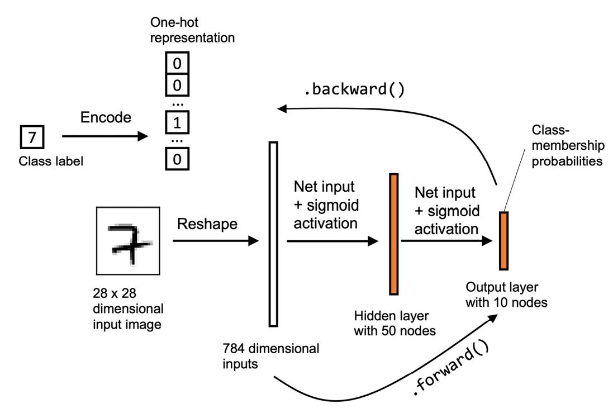

# Basics of Neural Networks

One artificial neuron, the rule that trains it, and why that rule had to change.

<!--
Everything today is one neuron. The multilayer network at the end is just this
slide's neuron, repeated.
-->

---
layout: default
title: Outline
---

# Outline

<v-clicks>

- Artificial neurons and neural networks
- Implementing and training a multilayer neural network from scratch

</v-clicks>

<div v-click class="mt-8">
  <Citation source="Based throughout on Raschka, Liu & Mirjalili — Machine Learning with PyTorch and Scikit-Learn" />
</div>

---
layout: section
index: "01"
---

# Artificial neurons

---
layout: interactive
title: The biological neuron, and what we kept
aside-width: 16rem
---

<NeuronAnatomy />

::aside::

Click a part: it highlights in both diagrams at once.

The two usually left out matter most. A spike starts at the **axon hillock**,
and only past a threshold — which becomes the **bias**. The spike is
**all-or-none** — which is the unit step.

<div class="mt-3 dl-secondary">
Read the red line each time: a caricature of a nerve cell, not a model of one.
</div>

<div class="mt-3">
  <Citation source="Kandel et al., Principles of Neural Science" />
</div>

<!--
Do not oversell the analogy. It is where the words came from and very little
more — overselling it is part of what set up the first AI winter.
-->


---
layout: default
title: History of the artificial neuron
---

# History of the artificial neuron

<div class="grid grid-cols-2 gap-8 mt-2">
<div v-click>

### 1943 — the MCP neuron

**McCulloch & Pitts** publish *A Logical Calculus of the Ideas Immanent in
Nervous Activity*: a nerve cell as a simple logic gate.

</div>
<div v-click>

### 1957 — the perceptron

**Frank Rosenblatt**, at the Cornell Aeronautical Laboratory, publishes the
first perceptron **learning rule** on top of the MCP model.

</div>
</div>

<div v-click class="mt-8 dl-callout">
Rosenblatt's algorithm learns the weight coefficients that get multiplied with
the input features, in order to decide whether the neuron fires.
</div>

<div class="absolute bottom-12 left-12">
  <Citation source="historyofinformation.com" url="https://www.historyofinformation.com/" />
</div>

---
layout: interactive
title: A sample dataset — Iris
aside-width: 12rem
---

<IrisDataset>
  <template #setosa></template>
  <template #versicolor></template>
  <template #virginica></template>
</IrisDataset>

::aside::

**Iris**, Fisher 1936. 150 flowers, 50 per species.

**Sepals** are the outer whorl — on an iris, the drooping *falls*. **Petals**
are the inner *standards*.

Click a species: both are redrawn to scale from a real row.

<div class="mt-3 dl-callout">
Petal length: 1.5 → 4.1 → 5.5 cm. That column does most of the work.
</div>

<!--
Ask which measurement they would pick if allowed only one. The drawing answers
it before the scatter plot does.
-->

---
layout: default
title: The Iris data, as a table
---

# What one row actually contains

<div class="grid grid-cols-[1.5fr_1fr] gap-7 mt-1">
<div>

<table class="dl-iris-table">
<thead>
<tr>
<th><Katex expr="i" /></th>
<th><Katex expr="x_1" /><br><span>sepal length</span></th>
<th><Katex expr="x_2" /><br><span>sepal width</span></th>
<th><Katex expr="x_3" /><br><span>petal length</span></th>
<th><Katex expr="x_4" /><br><span>petal width</span></th>
<th><Katex expr="y" /></th>
<th>class</th>
</tr>
</thead>
<tbody>
<tr><td>1</td><td>5.1</td><td>3.5</td><td>1.4</td><td>0.2</td><td>0</td><td><em>setosa</em></td></tr>
<tr><td>2</td><td>4.9</td><td>3.0</td><td>1.4</td><td>0.2</td><td>0</td><td><em>setosa</em></td></tr>
<tr class="is-gap"><td>⋮</td><td></td><td></td><td></td><td></td><td></td><td></td></tr>
<tr><td>51</td><td>7.0</td><td>3.2</td><td>4.7</td><td>1.4</td><td>1</td><td><em>versicolor</em></td></tr>
<tr><td>52</td><td>6.4</td><td>3.2</td><td>4.5</td><td>1.5</td><td>1</td><td><em>versicolor</em></td></tr>
<tr class="is-gap"><td>⋮</td><td></td><td></td><td></td><td></td><td></td><td></td></tr>
<tr><td>101</td><td>6.3</td><td>3.3</td><td>6.0</td><td>2.5</td><td>2</td><td><em>virginica</em></td></tr>
<tr><td>102</td><td>5.8</td><td>2.7</td><td>5.1</td><td>1.9</td><td>2</td><td><em>virginica</em></td></tr>
</tbody>
</table>

<div class="mt-2 dl-secondary">All four measurements in centimetres.</div>

<div class="mt-6">
  <Citation source="Fisher (1936), via the UCI Machine Learning Repository" url="https://archive.ics.uci.edu/dataset/53/iris" />
</div>

</div>
<div>

### The target variable

<div class="dl-tight">

<v-clicks>

- The file stores the class as **text**: `Iris-setosa`, `Iris-versicolor`,
  `Iris-virginica`. It has to be encoded before any arithmetic.
- We map those to $0$, $1$, $2$ — but that order is **arbitrary**. The classes
  are nominal; nothing says versicolor lies between the other two.
- Today's neuron is **binary**, so we take setosa vs versicolor, two of the four
  features, and $y \in \{0, 1\}$.

</v-clicks>

<div v-click class="mt-3 dl-callout">
Three classes need three output units — <strong>one-hot</strong> encoding.
Later today.
</div>

</div>

</div>
</div>

---
layout: default
title: The notation
---

# The notation

<div class="grid grid-cols-2 gap-6 mt-2">
<div>

That table, written the way every equation from here on will assume:

<div class="dl-math-xs">

$$
X =
\begin{bmatrix}
x_1^{(1)} & \cdots & x_4^{(1)} \\
x_1^{(2)} & \cdots & x_4^{(2)} \\
\vdots & \ddots & \vdots \\
x_1^{(150)} & \cdots & x_4^{(150)}
\end{bmatrix}
\in \mathbb{R}^{150 \times 4}
$$

</div>

</div>
<div>

<v-clicks>

- A **row** of $X$ is one flower — one training example, written $\mathbf{x}^{(i)}$.
- A **column** is one feature across all 150 examples.
- The superscript $(i)$ indexes the example; the subscript $j$ indexes the feature.
- Target variables: $\mathbf{y} = [\,y^{(1)}, \ldots, y^{(150)}\,]^\top$

</v-clicks>

</div>
</div>

<!--
Fix this notation now. Every equation for the rest of the course uses it.
-->

---
layout: default
title: The formal definition of an artificial neuron
---

# The formal definition of an artificial neuron

<div class="grid grid-cols-2 gap-10 mt-2 dl-math-xs">
<div>

**Weight vector and input values**

$$
\mathbf{w} = \begin{bmatrix} w_1 \\ \vdots \\ w_m \end{bmatrix},
\qquad
\mathbf{x} = \begin{bmatrix} x_1 \\ \vdots \\ x_m \end{bmatrix}
$$

<div v-click class="mt-4">

**Net input**

$$ z = w_1 x_1 + w_2 x_2 + \cdots + w_m x_m $$

</div>
</div>
<div>

<div v-click>

**Unit step function**

$$
\sigma(z) =
\begin{cases}
1 & \text{if } z \ge \theta \\
0 & \text{otherwise}
\end{cases}
$$

</div>

</div>
</div>

---
layout: default
title: From threshold to bias
---

# From threshold to bias

<div class="grid grid-cols-2 gap-10 mt-4 dl-math-sm">
<div>

Bring the threshold to the left-hand side:

$$ z \ge \theta \quad\Longleftrightarrow\quad z - \theta \ge 0 $$

<div v-click class="mt-6">

Then rename $-\theta$ as the **bias** $b$:

$$
\begin{aligned}
z &= w_1x_1 + \cdots + w_mx_m + b \\
  &= \mathbf{w}^\top\mathbf{x} + b
\end{aligned}
$$

</div>
</div>
<div v-click>

The step now compares against zero:

$$
\sigma(z) =
\begin{cases}
1 & \text{if } z \ge 0 \\
0 & \text{otherwise}
\end{cases}
$$

<div class="mt-6 dl-callout">
The bias is not a new idea — it is the threshold, moved. Every framework from
here on has a <code>bias=True</code> argument for exactly this.
</div>

</div>
</div>

---
layout: interactive
title: The decision function of the perceptron
aside-width: 13rem
---

<PerceptronPlayground mode="boundary" />

::aside::

$\sigma(\mathbf{w}^\top\mathbf{x} + b)$ splits the plane with a **linear
decision boundary**: the line where $z = 0$, with one side firing and the other
not.

Drag $w_1, w_2$ to **rotate** it, $b$ to **slide** it. That is the whole model.

<div class="mt-3 dl-secondary">
Right: the same 24 points collapsed to one number each. The step cuts that axis
at zero.
</div>

---
layout: default
title: The perceptron learning rule
---

# The perceptron learning rule

<div class="grid grid-cols-2 gap-10 mt-2">
<div>

1. Initialise $\mathbf{w}$ and $b$ to $0$ or small random numbers.
2. For each training example $\mathbf{x}^{(i)}$:
   - compute the output $\hat{y}^{(i)}$
   - update $\mathbf{w}$ and $b$

</div>
<div>

$$ \Delta w_j = \eta\,\bigl(y^{(i)} - \hat{y}^{(i)}\bigr)\,x_j^{(i)} $$

$$ \Delta b = \eta\,\bigl(y^{(i)} - \hat{y}^{(i)}\bigr) $$

<div v-click class="mt-4 dl-callout">

Note there is **no** $x$ in the bias update — the bias has no input to scale it.

</div>

</div>
</div>

---
layout: interactive
title: The whole perceptron, error loop included
aside-width: 13rem
---

<PerceptronDiagram />

::aside::

The same neuron as slide 4, with the part the learning rule needs: the output is
**compared** against the true label $y$, and that error is what travels back to
the weights.

<div class="mt-3 dl-secondary">
Move a slider until the prediction flips, then press <strong>Apply update</strong>.
The two cases the next slides work through by hand are both one control away.
</div>

<!--
Drive this one live. Set y = 1 with a negative z, apply the update twice, and
let them see z cross zero — then set the prediction right and show that every
delta collapses to zero.
-->

---
layout: default
title: Example (1/2) — correct predictions
---

# Example (1/2)

With two input features, all weights and the bias update simultaneously.

<div class="mt-4">

**What happens when the prediction is already correct?**

</div>

<div v-click class="mt-3 dl-math-sm">

$$
\begin{aligned}
(1)\quad & y^{(i)} = 0,\; \hat{y}^{(i)} = 0 \\
         & \Delta w_j = \eta(0 - 0)\,x_j^{(i)} = 0, \qquad \Delta b = 0 \\[8pt]
(2)\quad & y^{(i)} = 1,\; \hat{y}^{(i)} = 1 \\
         & \Delta w_j = \eta(1 - 1)\,x_j^{(i)} = 0, \qquad \Delta b = 0
\end{aligned}
$$

</div>

<div v-click class="mt-4 dl-callout">
Nothing moves. The rule only ever learns from its mistakes — which is also why
it stops the moment the data is separated.
</div>

---
layout: default
title: Example (2/2) — wrong predictions
---

# Example (2/2)

In the case of <span class="dl-wrong">wrong</span> predictions:

<div v-click class="mt-3 dl-math-sm">

$$
\begin{aligned}
(3)\quad & y^{(i)} = 1,\; \hat{y}^{(i)} = 0 \\
         & \Delta w_j = \eta(1-0)\,x_j^{(i)} = \eta\,x_j^{(i)}, \quad \Delta b = \eta \\[8pt]
(4)\quad & y^{(i)} = 0,\; \hat{y}^{(i)} = 1 \\
         & \Delta w_j = \eta(0-1)\,x_j^{(i)} = -\eta\,x_j^{(i)}, \quad \Delta b = -\eta
\end{aligned}
$$

</div>

<div v-click class="mt-8 dl-callout">
Both updates point the boundary the right way. How <em>far</em> it moves is set
by the feature value.
</div>

---
layout: default
title: The size of the correction
---

# The size of the correction

Compare $x_j = 1.5$ against $x_j = 2$, taking $\eta = 1$ and case (3):

<div class="grid grid-cols-2 gap-8 mt-6 dl-math-sm">
<div class="dl-compare">

<div class="dl-secondary mb-1">

$x_j = 1.5$

</div>

$$ \Delta w_j = (1-0)\,1.5 = 1.5 $$

$$ \Delta b = (1-0) = 1 $$

</div>
<div class="dl-compare">

<div class="dl-secondary mb-1">

$x_j = 2$

</div>

$$ \Delta w_j = (1-0)\,2 = 2 $$

$$ \Delta b = (1-0) = 1 $$

</div>
</div>

<div v-click class="mt-6 dl-callout">
The weight update scales with the feature; the bias update does not. So a
feature measured on a larger scale drags the weights harder — which is exactly
why <strong>feature scaling</strong> matters, and we come back to it shortly.
</div>

---
layout: interactive
title: The perceptron learning rule, running
aside-width: 17rem
---

<PerceptronPlayground />

::aside::

Every step applies the rule to one example. Watch the boundary rotate towards
the misclassified point.

**Convergence** is only guaranteed if the two classes are linearly separable —
turn the toggle off and run a few epochs.

---
layout: interactive
title: The big picture
aside-width: 15rem
---

<PerceptronDiagram static />

::aside::

<div class="dl-tight">

<v-clicks>

- Inputs $\mathbf{x}$, scaled by weights $\mathbf{w}$
- Summed into the net input $z = \mathbf{w}^\top\mathbf{x} + b$
- Thresholded into a class label $\hat{y} = \sigma(z)$
- Compared against the true label $y$
- The error drives $\Delta\mathbf{w}$ and $\Delta b$

</v-clicks>

<div v-click class="mt-4 dl-prompt">
Can you read the whole diagram now?
</div>

</div>

<!--
"Can you understand this now?" — the 2025 deck asked this over a repeated
screenshot. Ask it, then step through the list against the diagram.
-->

---
layout: section
index: "02"
---

# ADAptive LInear NEuron

---
layout: default
title: ADALINE
---

# ADALINE <span class="dl-secondary">(the Widrow–Hoff rule)</span>

<v-clicks>

- Published by **Bernard Widrow** and his doctoral student **Tedd Hoff**, only a
  few years after Rosenblatt's perceptron.
- It is the natural next step: it illustrates how to define and **minimise a
  continuous loss function**.
- The key change: weights are updated from a **linear** activation, rather than
  from a unit step.

</v-clicks>

---
layout: interactive
title: Perceptron vs Adaline
aside-width: 11rem
---

<PerceptronVsAdaline />

::aside::

The **same network** twice. One edge moves — the red tap — and everything else
follows from it.

<div class="mt-3 dl-secondary">
Click a row to take it on its own.
</div>

---
layout: default
title: Perceptron vs Adaline — the differences
---

# What follows from moving that one edge

<div class="dl-compare-table mt-3">

| | **Perceptron** — Rosenblatt, 1957 | **Adaline** — Widrow & Hoff, 1960 |
| --- | --- | --- |
| Learning activation | unit step, $\sigma(z) \in \{0, 1\}$ | linear, $\sigma(z) = z$ |
| Error measured from | the **thresholded** label $\hat{y}$ | the **continuous** $\sigma(z)$, before thresholding |
| Loss function | none — it minimises nothing | mean squared error: differentiable **and** convex |
| How the weights move | a hand-written correction, one example at a time, only on a mistake | **gradient descent**, over all $n$ examples, every step |
| Converges | only if the classes are linearly separable | always — to the single MSE minimum, separable or not |

</div>

<div class="mt-2 text-right">
  <Citation source="Raschka — “Perceptron, Adaline, and neural network models”" url="https://sebastianraschka.com/faq/docs/diff-perceptron-adaline-neuralnet.html" />
</div>

<div class="mt-2 dl-callout">
The unit step's derivative is zero everywhere it exists — which is the whole
reason the perceptron has no loss to descend.
</div>

---
layout: default
title: Minimising the loss function
---

# Minimising the loss function

Mean squared error, as the objective to minimise:

<div class="dl-math-sm">

$$ L(\mathbf{w}, b) = \frac{1}{2n} \sum_{i=1}^{n} \Bigl(y^{(i)} - \sigma\bigl(z^{(i)}\bigr)\Bigr)^2 $$

</div>

<div v-click class="mt-3 dl-secondary">

The $\tfrac{1}{2}$ is there purely for convenience — it cancels the 2 that falls
out when we differentiate.

</div>

<div v-click class="mt-4">

Because the activation is **linear**:

<v-clicks>

- the loss is **differentiable**
- the loss is **convex** — one minimum, no local traps
- so we can use **gradient descent** to find it

</v-clicks>

</div>

---
layout: interactive
title: How gradient descent works
aside-width: 16rem
---

<GradientDescent1D />

::aside::

Where the gradient is positive, step in the **opposite** direction. How far is
the learning rate $\eta$.

Push $\eta$ past **2.0** and the loss climbs instead of falling — slide 21 of
the old deck, answered by doing it.

---
layout: default
title: The update, written out
---

# The update, written out

<div class="grid grid-cols-2 gap-6 mt-2 dl-math-xs">
<div>

$$ \mathbf{w} := \mathbf{w} + \Delta\mathbf{w}, \qquad b := b + \Delta b $$

<div v-click class="mt-6">

$$ \Delta\mathbf{w} = -\eta\,\nabla_{\mathbf{w}} L(\mathbf{w}, b) $$

$$ \Delta b = -\eta\,\nabla_{b} L(\mathbf{w}, b) $$

</div>

<div v-click class="mt-4 dl-secondary">
The gradient of the loss. But how do we actually calculate it?
</div>

</div>
<div v-click>

$$ \frac{\partial L}{\partial w_j} = -\frac{1}{n} \sum_i \bigl(y^{(i)} - \sigma(z^{(i)})\bigr)\, x_j^{(i)} $$

$$ \frac{\partial L}{\partial b} = -\frac{1}{n} \sum_i \bigl(y^{(i)} - \sigma(z^{(i)})\bigr) $$

<div class="mt-6">

$$ \Delta w_j = -\eta\,\frac{\partial L}{\partial w_j} $$

$$ \Delta b = -\eta\,\frac{\partial L}{\partial b} $$

</div>

</div>
</div>

---
layout: default
title: How do we calculate the MSE derivative?
---

# How do we calculate the MSE derivative?

<div class="dl-derivation dl-math-sm">

<div>

$$ \frac{\partial L}{\partial w_j} = \frac{\partial}{\partial w_j} \frac{1}{2n} \sum_i \Bigl(y^{(i)} - \sigma(z^{(i)})\Bigr)^2 $$

</div>

<div v-click>

$$ = \frac{1}{n} \sum_i \Bigl(y^{(i)} - \sigma(z^{(i)})\Bigr) \frac{\partial}{\partial w_j}\Bigl(y^{(i)} - \sigma(z^{(i)})\Bigr) $$

</div>

<div v-click>

$$ = \frac{1}{n} \sum_i \Bigl(y^{(i)} - \sigma(z^{(i)})\Bigr) \frac{\partial}{\partial w_j}\Bigl(y^{(i)} - \sum_j \bigl(w_j x_j^{(i)} + b\bigr)\Bigr) $$

</div>

<div v-click>

$$ = \frac{1}{n} \sum_i \Bigl(y^{(i)} - \sigma(z^{(i)})\Bigr)\bigl(-x_j^{(i)}\bigr) = -\frac{1}{n} \sum_i \Bigl(y^{(i)} - \sigma(z^{(i)})\Bigr) x_j^{(i)} $$

</div>

</div>

<div v-click class="mt-4 dl-secondary">

The same approach gives $\partial L / \partial b$, except that the inner
derivative is $-1$ rather than $-x_j^{(i)}$.

</div>

<!--
The 2025 deck stated the loss with 1/2n but derived it as if it were 1/n, so
the printed result was -2/n. Here the 1/2 cancels the 2 and the result is -1/n,
which is what makes the "for convenience" remark true.
-->

---
layout: default
title: Why Adaline
---

# Why Adaline

<v-clicks>

- $\sigma(z)$ produces a **real number**, not an integer class label. There is a
  gradient to follow.
- The weight update is computed from **all** examples at once — full-batch
  gradient descent — rather than one at a time.

</v-clicks>

<div v-click class="mt-8 dl-callout">
Both of those become problems at scale. The first two fixes are on the next two
slides.
</div>

---
layout: interactive
title: Feature scaling — standardisation
aside-width: 17rem
---

<FeatureScaling />

::aside::

$$ x_j' = \frac{x_j - \mu_j}{\sigma_j} $$

Each feature gets mean $0$ and standard deviation $1$, so a single learning rate
suits every weight.

---
layout: interactive
title: Large-scale ML and stochastic gradient descent
aside-width: 23rem
---

<SGDvsBatch />

::aside::

Full-batch descent needs **every** example for one step. On a large dataset that
is unaffordable.

**Stochastic gradient descent** uses one example — or a mini-batch — per step.
Noisier, far cheaper, and it supports **online learning**.

With SGD we normally use an adaptive learning rate, e.g.

<div class="dl-math-xs">

$$ \eta = \frac{c_1}{[\text{number of iterations}] + c_2} $$

</div>

---
layout: default
title: The perceptron, in code
---

# The perceptron, in code

```python {all|3-5|7-9|11-16|all}{lines:true}
import numpy as np

def net_input(X, w, b):
    """z = Xw + b, for every example at once."""
    return X @ w + b

def predict(X, w, b):
    """The unit step function."""
    return np.where(net_input(X, w, b) >= 0.0, 1, 0)

def fit(X, y, eta=0.01, epochs=50):
    w, b = np.zeros(X.shape[1]), 0.0
    for _ in range(epochs):
        for xi, target in zip(X, y):
            error = target - predict(xi, w, b)
            w += eta * error * xi      # no x on the bias update
            b += eta * error
    return w, b
```

<div class="absolute bottom-12 right-12">
  <Citation source="Runnable version in the course notebook" />
</div>

---
layout: default
title: Adaline, in code
---

# Adaline, in code

The only change is **where the error comes from** — the continuous activation
rather than the thresholded label.

```python {all|4-5|7-9|all}{lines:true}
def fit_adaline(X, y, eta=0.01, epochs=50):
    w, b = np.zeros(X.shape[1]), 0.0
    for _ in range(epochs):
        output = net_input(X, w, b)        # linear activation, not a step
        errors = y - output

        # dL/dw = -(1/n) sum (y - sigma(z)) x
        w += eta * (X.T @ errors) / X.shape[0]
        b += eta * errors.mean()
    return w, b
```

<div v-click class="mt-4 dl-callout">
One indentation level fewer, too: the whole dataset updates at once instead of
one example at a time.
</div>

---
layout: section
index: "03"
---

# Implementing a multilayer ANN from scratch

---
layout: interactive
title: The multilayer perceptron
aside-width: 17rem
---

<MLPDiagram mode="static" :layers="[4, 6, 5, 3]" />

::aside::

Connect single neurons into a **multilayer feedforward** network.

More than one hidden layer makes it a **deep** neural network — and training
those needs special algorithms, which is where the term *deep learning* comes
from.

---
layout: interactive
title: One-hot representation
aside-width: 15rem
---

<OneHotDemo />

::aside::

One output unit per class, so the network never has to learn that class 2 is
"twice" class 1.

---
layout: interactive
title: The MLP learning procedure
aside-width: 16rem
---

<MLPDiagram />

::aside::

<v-clicks>

1. **Forward-propagate** the training patterns
2. **Calculate the loss**
3. **Backpropagate** it, finding the derivative with respect to every weight and bias
4. **Update** them

</v-clicks>

<div v-click class="mt-3 dl-secondary">
And this only works if the activations are <strong>non-linear</strong> — stack
linear layers and you still have a linear model.
</div>

---
layout: figure
title: Example — labelling handwritten digits
---



::caption::

The exercise for this week: an MLP on MNIST, written from scratch.

::citation::

<Citation source="Raschka, Liu & Mirjalili, ch. 11" />

---
layout: interactive
title: Backpropagation
aside-width: 20rem
---

<ActivationExplorer />

::aside::

**Why backpropagation?** To compute the partial derivatives of a complex,
non-convex function without doing the algebra by hand for every weight.

Select **Unit step**: the derivative is flat zero, which is exactly why the
perceptron could never be trained this way — and why the choice of activation
is the first thing that matters in a deep network.

---
layout: end
email: vajira@simula.no
next: PyTorch for Deep Learning
---

# To be continued…
