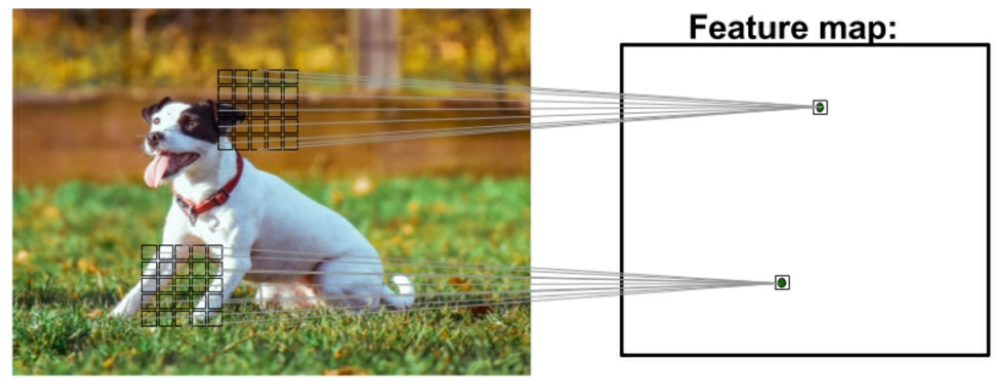
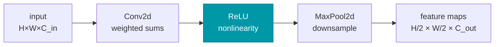
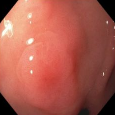
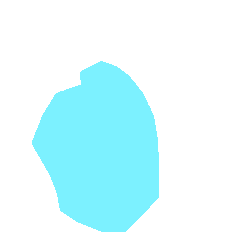
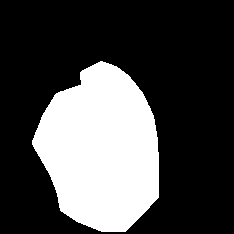
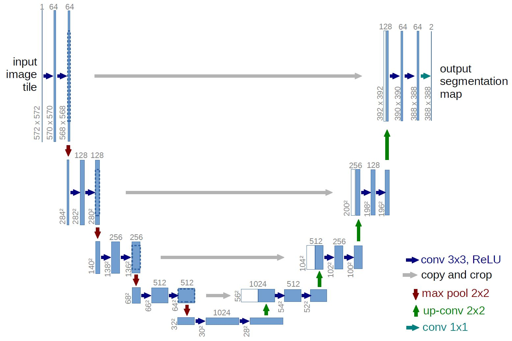
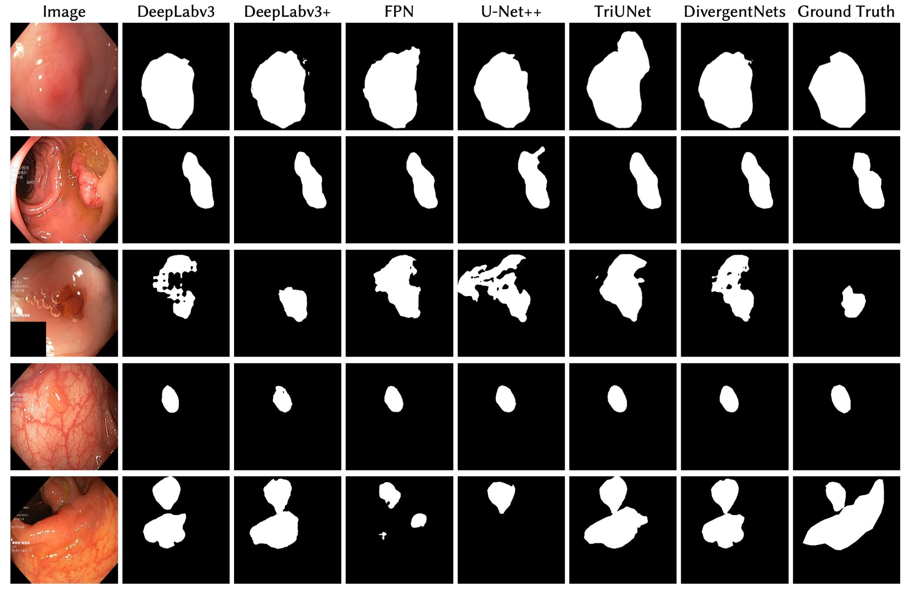

# Deep Convolutional Neural Networks

Images are local, and images repeat. Build both facts into a layer and the network we
had last week collapses into something far smaller that also sees better.

<!--
Two sessions. Today: why the MLP fails on images, and the convolution operation
itself, in one dimension and then two. Next: channels, pooling, the training
pieces, a real CNN in PyTorch, and where CNNs go after classification.

Everything in the first session is arithmetic they must be able to do by hand
before they touch nn.Conv2d. Do not rush slides 20–21.
-->

---
layout: interactive
heading: Where we are
title: Where we are
aside-width: 15rem
---

<SyllabusTimeline :current-week="4" />

::aside::

Weeks 4 and 5 are one topic, split at the halfway point of this deck.

Last week's PyTorch pipeline does not change today. Only the model does.

<!--
Point out that this is the first architecture in the course. Everything up to
now has been a layer type and an optimiser.
-->

---
layout: section
index: "00"
---

# Why not just use the network we already have?

---
layout: interactive
heading: One fully-connected layer, pointed at a photo
title: One fully-connected layer, pointed at a photo
aside-width: 16rem
---

<ConvParamBudget />

::aside::

Last week's first layer, priced for real images.

Click **ImageNet photo**: one layer of 256 hidden units on a 224×224×3 image needs
**38.5 million** weights — before the second layer, and before anything is learned.

<div class="mt-3 dl-secondary">

Drag *image side*. The cost grows with the area of the picture.

</div>

<!--
Do the arithmetic out loud: 224 x 224 x 3 = 150,528 inputs, times 256 units.
Nobody trains that as a first layer.

Leave the convolution row unexplained for now — say "we will earn that number
in about fifteen minutes" and move on. It comes back on slide 10.
-->

---
layout: default
title: The second problem, which is worse
---

# The second problem, which is worse

A fully-connected layer has **one weight per pixel position**.

<v-clicks>

- Weight $w_{37}$ has learned something about *pixel 37* — and nothing about pixel 38
- Shift the digit three pixels to the right and none of that knowledge applies
- So "an edge" has to be learned again, separately, at **every** position in the frame

</v-clicks>

<div v-click class="mt-6 dl-callout">

The parameter count is the symptom. The disease is that position-locked weights cannot share
what they learn.

</div>

<!--
Ask the room: if we shifted every training image by three pixels, would the MLP
still work? Answer: it would have to be retrained, and the retrained weights
would be a shifted copy of the old ones — which is a clue about what to do.

No diagram here on purpose. The claim is about weights, not about the picture,
and a network diagram at half-column width is unreadable from the back row.
-->

---
layout: default
title: Two facts about images
---

# Two facts about images

<v-clicks>

- **Things are local.** A pixel is related to the pixels beside it, far more than to a pixel
  on the other side of the frame. An edge, a corner, a texture — each is a small
  neighbourhood of pixels, not a whole picture.
- **Things repeat.** The same edge, corner or texture can turn up anywhere in the frame,
  and it means the same thing wherever it turns up.

</v-clicks>

<div v-click class="mt-6 dl-callout">

Neither fact is true of the tabular data in Lecture 02 — column 3 of the Iris table is not
"next to" column 4. That is why the fully-connected layer was the right answer then and the
wrong answer now.

</div>

<!--
This is the hinge of the lecture. Sparse connectivity is fact one made into
wiring; parameter sharing is fact two made into wiring. Say that now, and refer
back to it on slides 8 and 9.
-->

---
layout: section
index: "01"
---

# What a CNN is

---
layout: default
title: Where the idea came from
---

# Where the idea came from

<div class="dl-callout">

Hubel and Wiesel, 1959: a microelectrode in the visual cortex of an anaesthetised cat, and
patterns of light in front of it. Different neurons fired for different patterns — and the
layers were **ordered**. Edges and straight lines early, complex shapes late.

</div>

<div v-click class="mt-5">

What a CNN borrows is that ordering, and the idea that a unit looks at a **small patch**.
Everything else comes from the two facts on the last slide.

</div>

<div class="mt-5">
  <Citation source="Via Raschka, Liu & Mirjalili, Machine Learning with PyTorch and Scikit-Learn" />
</div>

<!--
Deliberately short. The biology motivates the shape of the answer; it is not
the reason the answer works. If someone asks "is this how the brain works",
the honest answer is: no, and nobody claims it is.
-->

---
layout: interactive
heading: Idea 1 — sparse connectivity
title: Idea 1 — sparse connectivity
aside-width: 17rem
---

<ConvVsMLPWiring start="full" />

::aside::

Nine input pixels, and a layer above them.

**fully connected** — every output reads every pixel: 81 links, 81 weights.

<div v-click class="mt-2">

**+ sparse connectivity** — each output reads a patch of 3: 21 links, 21 weights. Press
*Next output* to walk the patches.

</div>

<div v-click class="mt-3 dl-secondary">

The patch a single output unit reads is its **local receptive field**.

</div>

<!--
Click the middle tab yourself and let the picture do the work. Then press Next
output a few times so they see the patch sliding.

Note the output row got shorter — 9 inputs, kernel 3, so 7 outputs. That is the
output-size formula, and we will derive it in twenty minutes. Flag it, do not
derive it here.
-->

---
layout: interactive
heading: Idea 2 — parameter sharing
title: Idea 2 — parameter sharing
aside-width: 17rem
---

<ConvVsMLPWiring start="local" />

::aside::

Sparse connectivity still learns 21 separate weights — the same edge detector, relearned at
every position.

<div v-click>

Press **+ parameter sharing**: every patch uses the *same* three weights. **3 numbers to
learn**, detected everywhere.

</div>

<div v-click class="mt-3 dl-callout">

The three coloured links are the same three weights, reused.

</div>

<!--
Emphasise that these are two independent ideas. Locally-connected layers with
per-position weights are a real thing and they cost 21 here versus 3. Sharing
is what buys translation equivariance, not locality.

The shared set of weights is the filter, or kernel. Introduce both words here.
-->

---
layout: default
title: What that bought us
---

# What that bought us

<div class="grid grid-cols-2 gap-10 mt-2 dl-math-sm">
<div>

**Fully connected**, 224×224×3 image, 256 units:

$$ 150\,528 \times 256 + 256 = 38\,535\,424 $$

<div v-click class="mt-5">

**One convolution layer**, 32 filters of 5×5:

$$ 5 \times 5 \times 3 \times 32 + 32 = 2\,432 $$

</div>
</div>
<div>

<div v-click>

Roughly **15 800×** fewer weights.

And the convolution layer's count does not depend on the image size at all — the same
2 432 weights work on a 384×384 endoscopy frame.

</div>

<div v-click class="mt-4 dl-callout">

Fewer parameters is the smaller half of the win. The larger half is that a feature learned
in one corner of the image is available in every other corner for free.

</div>
</div>
</div>

<!--
This is the payoff for slide 3. Put the two numbers side by side on the board if
the projector is small.

If someone objects that 2,432 weights cannot possibly be enough: correct, which
is why we stack many such layers. That is slide 30.
-->

---
layout: figure
heading: Feature maps and the receptive field
title: Feature maps and the receptive field
---



::caption::

Each element of the output — the **feature map** — is computed from one small patch of the
input. That patch is the element's **local receptive field**.

::citation::

<Citation source="Raschka, Liu & Mirjalili, Machine Learning with PyTorch and Scikit-Learn" />

<!--
Two patches, two feature-map elements. Same weights in both patches — that is
the picture of slide 9 drawn on a real image.

The word "feature map" is worth pausing on: it is an image, not a vector. It has
a width, a height, and a position that means something.
-->

---
layout: default
title: Layers as learned feature extractors
---

# Layers as learned feature extractors

<div class="grid grid-cols-2 gap-10 mt-2 dl-tight">
<div>

Classical machine learning needed **salient features**, and a domain expert supplied them —
petal length, in the Iris data. A CNN learns them instead, in a hierarchy:

<v-clicks>

- **early** → edges, blobs
- **later** → corners, textures, parts
- **last** → whole objects: a dog, a polyp
- **the head** → decides, using those features

</v-clicks>

</div>
<div>

<div v-click class="dl-callout">

This is why one architecture works on digits, chest X-rays and endoscopy frames. Nobody
writes a polyp detector — the layers are shown examples and arrive at their own features.

</div>

<div v-click class="mt-5 dl-prompt">

Which of those four rows has parameters to learn?

</div>

<div v-click class="mt-3 dl-secondary">

All of them. The hierarchy is not designed; it emerges.

</div>
</div>
</div>

<!--
2025 slide 4 put this before any mechanism, where it is just vocabulary. It
lands better here, after they have seen a filter being shared.

The prompt is worth actually asking — a surprising number of students assume
early layers are fixed edge detectors like Sobel.
-->

---
layout: section
index: "02"
---

# The convolution operation

---
layout: interactive
heading: Sliding a window over a vector
title: Sliding a window over a vector
aside-width: 16rem
---

<Conv1DLab />

::aside::

Eight numbers, and a filter of four.

Press **Next output**. The filter sits over the first four inputs, multiplies pairwise, adds
them up, and writes one number. Then it slides.

<div v-click class="mt-3 dl-secondary">

Five outputs from eight inputs. The window has to fit, so the output is shorter than the
input — hold that thought.

</div>

<!--
Do not write a formula yet. Step it three times and ask the room what the
fourth output will be before pressing again.

Values, for reference: 5.75, 9, 7.25, 7.5, 8.
-->

---
layout: default
title: Naming what we just did
---

# Naming what we just did

That operation is a **discrete convolution** of two vectors:

$$ \mathbf{y} = \mathbf{x} * \mathbf{w} $$

<div class="grid grid-cols-3 gap-8 mt-8">
<div v-click>

$\mathbf{x}$

<div class="dl-secondary">

the **input**, or signal — the thing we are looking at

</div>

</div>
<div v-click>

$\mathbf{w}$

<div class="dl-secondary">

the **filter**, or kernel — the shared weights from slide 9

</div>

</div>
<div v-click>

$*$

<div class="dl-secondary">the convolution operator</div>

</div>
</div>

<div v-click class="mt-8 dl-callout">

In Python, `*` is elementwise multiplication. It is not this. The notation clash is
unfortunate and permanent.

</div>

<!--
The one thing to be firm about: w is the learnable parameter. x is data. Every
slide from here on has both, and confusing them makes the backward pass
incomprehensible later.
-->

---
layout: default
title: The formula
---

# The formula

<div class="mt-4">

$$ y[i] = \sum_{k} x[i + k]\, w[k] $$

</div>

<v-clicks>

- $i$ indexes the **output** — one sum per output element
- $k$ indexes the **filter** — one term per weight
- The sum runs over the *filter*, not over the image

</v-clicks>

<div v-click class="mt-5 dl-callout">

$i + k$ can run off the end of $\mathbf{x}$: with 10 elements, a filter at $i = 8$ asks for
$x[10]$. Two ways out — stop early, or invent the missing values.

</div>

<!--
The textbook writes this sum from -inf to +inf with x[i - k], which is the
flipped version. We come to the flip on slide 23; teaching it first makes the
code they will write look wrong to them.

Say explicitly: the sum is over the filter, not over the image. Students who
think there is one sum for the whole layer never recover.
-->

---
layout: interactive
heading: Padding — give the window somewhere to stand
title: Padding — give the window somewhere to stand
aside-width: 16rem
---

<Conv1DLab :controls="['padding']" formula />

::aside::

**Padding** invents the missing values, and the invented value is zero.

Drag $p$. Each step adds one zero to each end, so a padded $\mathbf{x}$ has $n + 2p$
elements, and the output gets longer.

<div v-click class="mt-3 dl-secondary">

At $p = 0$ we get 5 outputs from 8 inputs. Find the $p$ that gives back all 8.

</div>

<!--
Answer to the aside: p = 2 with m = 4 gives 9, p = 1 gives 7 — with an even
kernel you cannot hit 8 exactly, which is exactly why kernels are odd in
practice. Let them discover that; it is a better lesson than the rule.

The padded zeros are drawn dashed and grey. Point out that a tap landing on one
contributes nothing to the sum, which is what makes zero the convenient choice.
-->

---
layout: default
title: Three conventions, three names
---

# Three conventions, three names

<div class="grid grid-cols-3 gap-6 mt-4">
<div v-click>

### Full

$p = m - 1$

Every position where the filter overlaps the input at all. The output is **larger** than the
input.

</div>
<div v-click>

### Same

$p = \lfloor m/2 \rfloor$ with $s = 1$

Just enough padding that the output is the **same size** as the input.

</div>
<div v-click>

### Valid

$p = 0$

No padding at all — only positions where the filter fits entirely inside the input. The
output **shrinks**.

</div>
</div>

<div v-click class="mt-6 dl-callout">

**Same** is the usual choice, and it is why kernel sizes are odd: $m = 3, 5, 7$ has a middle
pixel that $p = 1, 2, 3$ centres the filter on. $m = 4$ has none.

</div>

<!--
In PyTorch these are not modes, they are numbers: padding=0, padding=k//2,
padding=k-1. `padding="same"` exists in nn.Conv2d but only for stride 1.

This slide replaces the 2025 padding figure. Ask them which one shrinks before
revealing valid.
-->

---
layout: interactive
heading: Stride — how far the window jumps
title: Stride — how far the window jumps
aside-width: 16rem
---

<Conv1DLab :controls="['stride', 'padding']" formula />

::aside::

So far the window moved one element at a time. **Stride** $s$ is how far it jumps.

Drag $s$ to 2: the window skips a position each time, and the output is roughly half as
long.

<div v-click class="mt-3 dl-secondary">

Stride is the first way we will see of making a feature map *smaller* on purpose. It is not
the last.

</div>

<!--
At p = 0, s = 2 the outputs are 5.75, 7.25, 8 — the first, third and fifth of
the s = 1 outputs, which is worth saying out loud: a stride does not compute
anything new, it computes less.

Turn p up with s = 2 as well, so both sliders have moved before the formula
slide.
-->

---
layout: default
title: The size of the output
---

# The size of the output

Everything on the last four slides is one formula:

<div class="mt-6">

$$ o = \left\lfloor \frac{n + 2p - m}{s} \right\rfloor + 1 $$

</div>

<div class="grid grid-cols-4 gap-4 mt-8 dl-secondary">
<div v-click>

$n$ — input size

</div>
<div v-click>

$p$ — padding on each side

</div>
<div v-click>

$m$ — kernel size

</div>
<div v-click>

$s$ — stride

</div>
</div>

<div v-click class="mt-8 dl-callout">

Read it as: *how many places can the window stand?* $n + 2p$ is how much room there is,
$m$ is how much room the window needs, $s$ is how far apart the standing positions are, and
the $+1$ counts the first one.

</div>

<!--
This is the single most useful thing in the lecture. Every shape in every
architecture, for the rest of the course, is this formula applied repeatedly.

The floor is there because a window that does not fit does not get computed. It
is also where off-by-one bugs come from.
-->

---
layout: default
title: Your turn
---

# Your turn

<div class="dl-math-sm">

**1.** An input vector of size 10, kernel of size 5, padding 2, stride 1.

<div v-click class="mt-2">

$$ n = 10,\; m = 5,\; p = 2,\; s = 1 \;\Rightarrow\; o = \left\lfloor \frac{10 + 4 - 5}{1} \right\rfloor + 1 = 10 $$

<div class="dl-secondary">

Same size in, same size out — this is *same* padding.

</div>

</div>

<div v-click class="mt-6">

**2.** Same input, but kernel 3 and stride 2.

</div>

<div v-click class="mt-2">

$$ n = 10,\; m = 3,\; p = 2,\; s = 2 \;\Rightarrow\; o = \left\lfloor \frac{10 + 4 - 3}{2} \right\rfloor + 1 = 6 $$

<div class="dl-secondary">

The stride roughly halves it. $\lfloor 11/2 \rfloor = 5$, not 5.5.

</div>

</div>
</div>

<!--
Make them compute before clicking. Both of these take ten seconds and they will
be doing this on every layer of every architecture from now on.

The floor in question 2 is the point of question 2.
-->

---
layout: default
---

<PollSlide
  question="Kernel of size 5, stride 1. What padding gives the same output size as input?"
  :items="[
    'p = 1 — one zero on each side',
    'p = 2 — two zeros on each side',
    'p = 4 — as many as the kernel is wide, less one',
    'It depends on n',
  ]"
/>

<div v-click class="mt-6 dl-reveal">

p = 2

</div>

<div v-click class="mt-2 dl-secondary">

$o = \lfloor (n + 4 - 5)/1 \rfloor + 1 = n$, for any $n$. Which is the useful part: *same*
padding is a property of $m$ and $s$ alone.

</div>

<!--
Hands up for each option before revealing. p = 4 is full padding — a common
confusion, worth naming as such rather than just wrong.
-->

---
layout: interactive
heading: An aside — the textbook flips the filter
title: An aside — the textbook flips the filter
aside-width: 18rem
---

<Conv1DLab :controls="['flip', 'stride']" :stride="2" />

::aside::

The formal definition rotates the filter first — $x[i - k]$, not $x[i + k]$.

<div class="mt-2">

Tick **rotate the kernel first**: the same input now gives **7, 9, 8** instead of
**5.75, 7.25, 8**.

</div>

<div v-click class="mt-3 dl-callout">

`nn.Conv2d` does **not** flip — it computes *cross-correlation*. It makes no difference:
$\mathbf{w}$ is learned, so the network learns the flipped filter instead.

</div>

<!--
This exists because the textbook and every signal-processing course flip, and a
student who reads around will hit it. Say clearly: you never flip anything in
PyTorch, and no result in this course changes either way.

Convolution proper is associative and commutative, which is why signal
processing wants the flip. Neural networks use neither property.
-->

---
layout: interactive
heading: Two dimensions, same operation
title: Two dimensions, same operation
aside-width: 19rem
---

<Conv2DLab :stride="1" :padding="1" />

::aside::

<div class="dl-math-xs">

$$ Y_{i,j} = \sum_{k_1}\sum_{k_2} X_{i+k_1,\; j+k_2}\, W_{k_1,k_2} $$

</div>

Two sums, because the window now has a height as well as a width. Nothing else changes.

<div v-click class="mt-3 dl-secondary">

3×3 padded to 5×5, kernel 3×3, $s = 1$ → 3×3 out. The output-size formula, once per axis.

</div>

<!--
Press Next cell and read the sum out for the first output: most of the taps land
on padded zeros, so the sum is short. The widget says how many.

Emphasise that the output-size formula is applied twice — once per axis — and
that for a square image with a square kernel the two answers are the same, which
is why we write one number.
-->

---
layout: interactive
heading: The worked example
title: The worked example
aside-width: 17rem
---

<Conv2DLab :controls="['stride', 'flip']" flip :stride="2" :padding="1" />

::aside::

The example from the textbook: 3×3 input, 3×3 filter, $p = 1$, $s = 2$, filter rotated.

Step through all four cells. The answer is

<div class="mt-1 dl-math-xs">

$$ Y = \begin{bmatrix} 4.6 & 1.6 \\ 7.5 & 2.9 \end{bmatrix} $$

</div>

<div v-click class="mt-3 dl-secondary">

Untick the rotation and every number changes. Neither is more correct — but only one of them
is what your code will compute.

</div>

::citation::

<Citation source="Example from Raschka, Liu & Mirjalili, Machine Learning with PyTorch and Scikit-Learn" />

<!--
Four cells, nine products each. Do the first one on the board alongside the
widget so they see that the widget is not doing anything they cannot.

Output size: floor((3 + 2 - 3)/2) + 1 = 2. Ask for it before showing it.
-->

---
layout: default
title: Half time
---

# Half time

<div class="grid grid-cols-2 gap-10 mt-2">
<div>

### What we have

<v-clicks>

- Images are **local** and **repeating**
- **Sparse connectivity** + **parameter sharing**
- Slide a filter, multiply, sum
- One formula for every shape

</v-clicks>

</div>
<div>

### What is missing

<v-clicks>

- **Channels**, and many filters per layer
- Feature maps that get **smaller**
- Nonlinearity, dropout, a loss
- And none of it is code yet

</v-clicks>

</div>
</div>

<div v-click class="mt-5 dl-callout">

If you can compute a convolution's output shape by hand, you have the hard half.

</div>

<!--
Natural break point — end of week 4 if the two sessions are a week apart.

Set the expectation for the second half: no new mathematics, only bookkeeping
and code.
-->

---
layout: section
index: "03"
---

# Channels and depth

---
layout: interactive
heading: Many filters, many feature maps
title: Many filters, many feature maps
aside-width: 21rem
---

<ConvStackDiagram mode="channels" :c-in="3" :c-out="5" />

::aside::

A colour image is three numbers per pixel, so the input is $H \times W \times 3$.

Press **Next filter**. Each filter is itself 3 deep: it reads all three channels, sums the
three results, and writes **one** output feature map.

<div v-click class="mt-3 dl-callout dl-math-sm">

Five filters → five output feature maps. The layer's weights are one tensor of shape
$m_1 \times m_2 \times C_{\text{in}} \times C_{\text{out}}$.

</div>

<!--
The thing to make unmissable: the number of output channels is the number of
filters, and each filter is a full-depth stack. Students who think a filter is
2D never get the shape of the weight tensor right.

The sum over input channels is not optional and there is no weight on it — it is
part of the definition of the operation.
-->

---
layout: default
title: Counting a convolution layer's parameters
---

# Counting a convolution layer's parameters

<div class="mt-4">

$$ \text{weights} = m_1 \times m_2 \times C_{\text{in}} \times C_{\text{out}} \;+\; \underbrace{C_{\text{out}}}_{\text{one bias per filter}} $$

</div>

<div v-click class="mt-6 dl-math-sm">

A 5×5 layer taking a colour image to 32 feature maps:

$$ 5 \times 5 \times 3 \times 32 + 32 = 2\,432 $$

</div>

<v-clicks>

- $H$ and $W$ do not appear — the layer's size is independent of the image's
- Double the kernel side and the cost quadruples: 3×3 is everywhere, 11×11 is history

</v-clicks>

<!--
Same number as slide 10, now derived rather than asserted.

The third bullet is the setup for the next slide. If someone asks why not one
huge kernel, say "hold that", then answer it with the widget.
-->

---
layout: interactive
heading: Why stack small kernels instead of using one big one
title: Why stack small kernels instead of using one big one
aside-width: 20rem
---

<ConvStackDiagram mode="receptive-field" :kernel="3" :max-depth="3" />

::aside::

The highlighted region is what one output unit can see, back at the input. Drag
**stacked layers**:

<v-clicks>

- 1 layer sees 3×3
- 2 layers see 5×5 — **18** weights, not 25
- 3 layers see 7×7 — **27** weights, not 49

</v-clicks>

<div v-click class="mt-3 dl-callout">

Same reach, fewer weights, one nonlinearity per layer.

</div>

<!--
This is the single idea behind VGG and everything after it, and the 2025 deck
did not have it.

The receptive field is why depth matters at all: a shallow network physically
cannot see a large object, however many filters it has.
-->

---
layout: section
index: "04"
---

# Subsampling

---
layout: interactive
heading: Pooling
title: Pooling
aside-width: 16rem
---

<PoolingLab />

::aside::

A **pooling** layer summarises each window with one number and does not overlap the windows.

**Max-pooling** keeps the largest value — highlighted in each window. **Mean-pooling** takes
the average.

<div v-click class="mt-3 dl-callout">

Pooling has **no learnable parameters**. There is nothing to train: it is a fixed function
of its input.

</div>

<!--
The numbers are the ones from the 2025 slide, so max-pool gives 8, 5, 6, 3 and
mean-pool 3.78, 2.33, 3, 1.22. Switch modes and let them check one window.

Note the window size and the stride are equal here — that is what P_3x3 means,
and it is the default in nn.MaxPool2d when you only give a kernel size.
-->

---
layout: interactive
heading: What pooling is actually for
title: What pooling is actually for
aside-width: 20rem
---

<PoolingLab invariance />

::aside::

Two claims are usually made for pooling. Test them.

Press **Nudge the pixels**: every pixel that was not its window's maximum moves.

<v-clicks>

- **Max-pool**: output unchanged — **local invariance**
- **Mean-pool**: output changes. The guarantee is max-pooling's, not pooling's in general
- Both **shrink** the map: nine times less work above

</v-clicks>

<!--
The 2025 deck asserted local invariance by printing two matrices with the same
max-pooled result. Running it is better, and it also catches the overstatement:
"pooling introduces local invariance" is only true of max-pooling.

Press Nudge several times — a different perturbation each time, same output.
-->

---
layout: default
title: Or skip pooling entirely
---

# Or skip pooling entirely

<div class="grid grid-cols-2 gap-10 mt-2">
<div>

### Pool, stride 2

<v-clicks>

- Fixed function, **no parameters**
- Max is a hard choice: it throws away everything else in the window
- One extra layer in the diagram

</v-clicks>

</div>
<div>

### Convolution, stride 2

<v-clicks>

- **Learnable** — the downsampling itself is trained
- Costs $m_1 m_2 C_{\text{in}} C_{\text{out}}$ weights, like any conv layer
- Does the convolution *and* the downsampling in one layer

</v-clicks>

</div>
</div>

<div v-click class="mt-5 dl-callout">

Both halve the feature map. Modern architectures often prefer the strided convolution — a
network can learn a better summary than "take the largest". Classic ones pool.

</div>

<!--
2025 slide 21 mentioned this in one line. It deserves the comparison, because
"why is there no pooling in this ResNet" is a question that comes up.

The honest summary: it is an architectural choice with no universal winner.
-->

---
layout: section
index: "05"
---

# Training a CNN

---
layout: default
title: The real unit is conv → ReLU → pool
---

# The real unit is conv → ReLU → pool

A convolution is a weighted sum. Stack two of them with nothing in between and you have —
a weighted sum.

<div v-click class="mt-4">



</div>

<v-clicks>

- The **nonlinearity goes between** the convolution and the pooling, on every conv layer
- It is almost always **ReLU**: $\max(0, z)$ — cheap, and it does not saturate
- Without it, depth buys nothing at all: the whole stack collapses to a single linear map

</v-clicks>

<!--
Straight back to Lecture 02's activation-function discussion. Same argument, new
layer type — which is worth saying explicitly, because students file "activation
function" under MLP and are surprised to need it here.

ReLU has no parameters, so it does not appear in any parameter count.
-->

---
layout: interactive
heading: Dropout
title: Dropout
aside-width: 18rem
---

<MLPDiagram mode="dropout" :layers="[5, 8, 8, 4]" :p="0.5" />

::aside::

**Dropout** drops each hidden unit independently, with probability $p$, on every
mini-batch.

Press **model.train()**, then **New mini-batch** a few times: a different half each time, so
no unit can depend on a particular neighbour.

<div v-click class="mt-3 dl-callout">

At evaluation nothing is dropped — that is what `model.eval()` selects.

</div>

<!--
Two things students get wrong: that the two pictures are two networks (they are
one network in two modes), and that dropout does something at test time (it does
not).

In a CNN, dropout normally goes in the fully-connected head, not between conv
layers — the conv layers have few enough parameters that they rarely need it.
-->

---
layout: default
title: Batch normalisation, in one slide
---

# Batch normalisation, in one slide

Standardise each channel across the mini-batch, then let the network rescale it with two
learned parameters.

<div class="mt-3 dl-math-sm">

$$ \hat{z} = \frac{z - \mu_{\text{batch}}}{\sqrt{\sigma^2_{\text{batch}} + \epsilon}}, \qquad \text{out} = \gamma \hat{z} + \beta $$

</div>

<v-clicks>

- **Feature scaling** from Lecture 02, applied mid-network
- `nn.BatchNorm2d(channels)`, between the convolution and the ReLU
- Train and eval behave differently — as with dropout

</v-clicks>

<div v-click class="mt-3 dl-secondary">

We use it, we do not derive it.

</div>

<!--
Optional slide — skip it if the session is running long, it is not needed for
the code that follows.

Worth one mention because every architecture they read about has it, and because
"why does my model behave differently in eval" has two answers, not one.
-->

---
layout: default
title: Which loss, and logits or probabilities
---

# Which loss, and logits or probabilities

| Loss | Use for | Expects | Last layer of the model |
| --- | --- | --- | --- |
| `BCELoss` | binary | probabilities in $[0,1]$ | `nn.Sigmoid()` |
| `BCEWithLogitsLoss` | binary | **logits** | nothing |
| `NLLLoss` | multiclass | log-probabilities | `nn.LogSoftmax(dim=1)` |
| `CrossEntropyLoss` | multiclass | **logits** | nothing |

<div v-click class="mt-6 dl-callout">

**The trap.** `CrossEntropyLoss` applies the log-softmax itself. Put a `Softmax` on the end
of your model as well and you have applied it twice: training still runs, the loss still
goes down, and the accuracy is quietly worse. Same for `BCEWithLogitsLoss` and `Sigmoid`.

</div>

<div v-click class="mt-3 dl-secondary">

Prefer the logits versions: more stable, and one fewer place to make this mistake.

</div>

<!--
2025 slide 24 was a screenshot of this table from the book. The rows are the
same; the last column and the callout are the part that stops the bug.

Ask what the model's last layer should be if the loss is CrossEntropyLoss. The
answer "nothing" surprises people every year.
-->

---
layout: section
index: "06"
---

# A CNN in PyTorch

---
layout: interactive
heading: The architecture, as a shape ledger
title: The architecture, as a shape ledger
aside-width: 16rem
---

<CNNArchitecture />

::aside::

The classic MNIST CNN. **Next stage** shows each output shape and its parameters.

<v-clicks>

- Every shape is the output-size formula, applied again
- 3.27 million parameters in total
- The bar says where they live: the first dense layer holds **98%**

</v-clicks>

<!--
Click through it and read the shapes aloud: 28 -> 28 -> 14 -> 14 -> 7, then 3136
flattened.

The 98% is worth dwelling on: the part of the network we spent the whole lecture
motivating holds 1.6% of its weights. That imbalance is what global average
pooling and fully-convolutional networks exist to fix.
-->

---
layout: default
title: Defining the module
---

# The feature extractor

```python {all|6-8|6|8|9-11|all}{lines:true}
from torch import nn

class MnistCNN(nn.Module):
    def __init__(self, n_classes=10):
        super().__init__()
        self.features = nn.Sequential(
            nn.Conv2d(1, 32, kernel_size=5, padding=2),    # 28×28×1  → 28×28×32
            nn.ReLU(),
            nn.MaxPool2d(kernel_size=2),                   # 28×28×32 → 14×14×32
            nn.Conv2d(32, 64, kernel_size=5, padding=2),   # 14×14×32 → 14×14×64
            nn.ReLU(),
            nn.MaxPool2d(kernel_size=2),                   # 14×14×64 → 7×7×64
        )
```

<div v-click class="mt-3 dl-secondary">

`Conv2d(in_channels, out_channels, …)`. `padding=2` is *same* for a 5×5 kernel, and
`MaxPool2d` with only a kernel size uses that as its stride too.

</div>

<!--
Two conv blocks, each conv → ReLU → pool, exactly as on the "real unit" slide.

Every comment on the right is the output-size formula. They can check each one,
and they should — that is the whole point of having done it by hand.
-->

---
layout: default
title: The classifier head
---

# The classifier head

```python {all|2|3|4-5|6|all}{lines:true}
        self.classifier = nn.Sequential(
            nn.Flatten(),                                  # 7·7·64 = 3136
            nn.Linear(7 * 7 * 64, 1024),
            nn.ReLU(),
            nn.Dropout(0.5),
            nn.Linear(1024, n_classes),                    # logits — no softmax
        )
```

<v-clicks>

- `Flatten` throws the spatial layout away — from here on it is just a vector
- `7 * 7 * 64` is the shape the conv stack produced. Compute it, do not guess it
- The dropout sits in the head, where the parameters are
- No softmax: `CrossEntropyLoss` wants the logits

</v-clicks>

<!--
This is where 98% of the parameters are, and where the only dropout is. Both of
those are worth saying out loud again.
-->

---
layout: default
title: forward, and a shape check
---

# `forward`, and a shape check

```python {all|1-4|6-8|10-12|all}{lines:true}
    def forward(self, x):
        # x is (batch, channels, height, width) — PyTorch is channels-first
        x = self.features(x)         # (B, 64, 7, 7)
        return self.classifier(x)    # (B, 10) logits

model = MnistCNN()
x = torch.randn(8, 1, 28, 28)
print(model(x).shape)                            # torch.Size([8, 10])

print(sum(p.numel() for p in model.parameters()))
# 3274634  — the same 3.27 M the ledger showed
```

<div v-click class="mt-4 dl-callout">

Run the shape check before you run the training loop. It costs one second and catches
almost every mistake on the next slide.

</div>

<!--
The batch dimension is always first and is never in the architecture diagram.
That mismatch confuses people; say it now.

Two lines of code confirm both the output shape and the parameter count against
the ledger — that is the habit to teach.
-->

---
layout: default
title: The training loop, unchanged from last week
---

# The training loop, unchanged from last week

```python {all|1-3|5-6|7-9|10-11|12-14|all}{lines:true}
model = MnistCNN().to(device)
loss_fn = nn.CrossEntropyLoss()                  # logits in, integer labels
optimiser = torch.optim.Adam(model.parameters(), lr=1e-3)

for epoch in range(epochs):
    model.train()                                # dropout on
    for images, labels in train_loader:
        images = images.to(device)
        labels = labels.to(device)
        logits = model(images)
        loss = loss_fn(logits, labels)
        optimiser.zero_grad()
        loss.backward()
        optimiser.step()
```

<div v-click class="mt-3 dl-secondary">

Forward, loss, backward, step — the same four lines as Lecture 02's network. Only the model
changed.

</div>

<!--
This is the point of the slide: the pipeline from week 3 is untouched. A new
architecture is a new nn.Module, not a new training procedure.

model.train() at the top of every epoch, not once before the loop — the eval
function on the next slide flips the flag.
-->

---
layout: default
title: Evaluating
---

# Evaluating

```python {all|1-2|4|5-11|all}{lines:true}
@torch.no_grad()                                 # no graph, no gradients, less memory
def accuracy(model, loader, device):
    model.eval()                                 # dropout off
    correct = total = 0
    for images, labels in loader:
        images = images.to(device)
        labels = labels.to(device)
        predicted = model(images).argmax(dim=1)  # logits → class index
        correct += (predicted == labels).sum().item()
        total += labels.size(0)
    return correct / total
```

<v-clicks>

- `model.eval()` turns dropout off; `torch.no_grad()` saves memory. Separate concerns, both needed
- `argmax` on the logits needs no softmax — the largest logit is the largest probability

</v-clicks>

<!--
The two are independent and both are needed. A common bug is calling one and not
the other; another is never calling model.train() again afterwards.

argmax over logits is the practical reason logits are fine to leave unnormalised.
-->

---
layout: default
title: Three bugs you will hit
---

# Three bugs you will hit

<v-clicks>

- **The flatten size.** Get the 7 in `Linear(7 * 7 * 64, 1024)` wrong and the first forward
  pass fails. Recompute it, or `print(x.shape)` before the flatten.
- **Channels-first.** PyTorch wants `(B, C, H, W)`; image libraries hand you `(H, W, C)`.
- **Forgetting the mode.** No crash — just an accuracy number that makes no sense.

</v-clicks>

<div v-click class="mt-5 dl-callout">

All three are shape or state bugs. The output-size formula and a `print(x.shape)` find them all.

</div>

<!--
Worth the slide: these three account for most of the questions during the lab.

If there is time, break the flatten size live and read the error message
together — the error names both shapes, and learning to read it is the skill.
-->

---
layout: section
index: "07"
---

# Where CNNs go next

---
layout: interactive
heading: Classification, detection, segmentation
title: Classification, detection, segmentation
aside-width: 17rem
---

<CVTaskTriptych>
  
  <template #mask>
    
  </template>
</CVTaskTriptych>

::aside::

One image, three tasks. The difference is the **shape of the output**.

<v-clicks>

- **classification** — is there a polyp? 2 numbers
- **detection** — where? a box and a label, 6
- **segmentation** — which pixels? 54 756

</v-clicks>

<div v-click class="mt-3 dl-callout">

The output shape decides what the last layer can be.

</div>

::citation::

<Citation source="Frame and mask from Kvasir-SEG; via Thambawita et al., DivergentNets" url="https://datasets.simula.no/kvasir-seg/" />

<!--
The outline of the 2025 deck promised this comparison and the slides never
delivered it. It is a two-minute slide and it reframes everything after it.

Ask which of the three the model we just built can do. Answer: only the first.
-->

---
layout: default
title: Per-pixel output breaks the fully-connected head
---

# Per-pixel output breaks the fully-connected head

<div class="grid grid-cols-2 gap-10 mt-2">
<div>

Our classifier ends `Linear(3136, 10)`. A 234×234 mask needs 54 756 outputs:

<div class="mt-3 dl-math-sm">

$$ 3136 \times 54\,756 + 54\,756 \approx 172 \text{ M weights} $$

</div>

<v-clicks>

- Fifty times the whole network, in one layer
- And it discards what made convolution work: no spatial structure to share over

</v-clicks>

</div>
<div>

<div v-click>

<div class="dl-card dl-mask-tile">
  
  <div class="dl-card__cap">The target. It is an image, not a vector.</div>
</div>

</div>

<div v-click class="mt-4 dl-callout">

If the output is an image, the network should end in convolutions too — and it has to build
the resolution back up after all that pooling.

</div>
</div>
</div>

<!--
The 172 M number is the argument. Compute it with them: 3136 features in,
54,756 pixels out.

This is exactly the imbalance the architecture ledger showed on slide 41, taken
to its conclusion.
-->

---
layout: figure
heading: U-Net
title: U-Net
---



::caption::

Down the left, the CNN we just built: convolutions and pooling, resolution falling, channels
rising. Up the right, **up-convolutions** rebuilding it. Across the middle, **skip
connections** hand the fine detail from each encoder level to the matching decoder level.

::citation::

<Citation source="Ronneberger, Fischer & Brox, U-Net (2015)" url="https://arxiv.org/abs/1505.04597" />

<!--
Three things to point at: the U shape, the 1x1 convolution at the top right that
turns 64 channels into 2 class scores per pixel, and the grey arrows.

The skip connections are the insight. Pooling destroys the exact position of an
edge; the encoder still has it at full resolution, so hand it across rather than
trying to reconstruct it. Everything else here is week 4 material.
-->

---
layout: figure
heading: What it looks like on real data
title: What it looks like on real data
---

<FigureSpotlight
  :regions="[
    { x: 1, y: 4, w: 12, h: 96, label: 'the endoscopy frame', note: 'five frames, easy at the bottom, hard in the middle' },
    { x: 85, y: 4, w: 14, h: 96, label: 'what a clinician marked', note: 'the ground truth — itself one expert\'s judgement' },
    { x: 13, y: 4, w: 72, h: 96, label: 'six architectures, same input', note: 'all trained on the same data, all reasonable' },
    { x: 1, y: 40, w: 98, h: 22, label: 'the hard case', note: 'row 3: the models disagree with each other more than any of them disagrees with the ground truth' },
    { x: 1, y: 62, w: 98, h: 20, label: 'the easy case', note: 'row 4: everything agrees, and a single score would call this solved' },
  ]"
>
  
</FigureSpotlight>

::caption::

Five frames, six architectures, and the clinician's annotation on the right.

::citation::

<Citation source="Thambawita et al., DivergentNets; Kvasir-SEG" url="https://datasets.simula.no/kvasir-seg/" />

<!--
The teaching point is row 3, not the leaderboard. Segmentation quality is not one
number, and "which model is best" is the wrong question for a clinical task.

This is the data for the team project, so linger here.
-->

---
layout: default
title: The team project
---

# The team project

Train a U-Net to segment polyps in endoscopy frames.

<div class="grid grid-cols-3 gap-4 mt-6">
<div v-click>
  <LinkCard
    href="https://arxiv.org/abs/1505.04597"
    title="U-Net"
    blurb="Ronneberger et al., 2015 — the paper. Read sections 2 and 3."
    icon="📄"
  />
</div>
<div v-click>
  <LinkCard
    href="https://github.com/milesial/Pytorch-UNet"
    title="Pytorch-UNet"
    blurb="A clean reference implementation to read, adapt and beat."
    icon="💻"
  />
</div>
<div v-click>
  <LinkCard
    href="https://datasets.simula.no/kvasir-seg/"
    title="Kvasir-SEG"
    blurb="1000 annotated frames with clinician-drawn masks."
    icon="🗂"
  />
</div>
</div>

<div v-click class="mt-6">

**In teams.** Get it training, report a Dice score on a held-out split, and bring one frame
your model gets wrong — with a sentence on why you think it does.

</div>

<div v-click class="mt-3 dl-secondary">

The failure case is the graded part. Anyone can run someone else's training script.

</div>

<!--
Emphasise the last line. The point of the exercise is diagnosis, not the metric.

Practicalities — team size, split, deadline, what to hand in — belong on the
course page, not on this slide.
-->

---
layout: default
title: Where we got to
---

# Where we got to

<div class="grid grid-cols-2 gap-10 mt-2">
<div>

<v-clicks>

- **local** → sparse connectivity
- **repeating** → parameter sharing
- Together: a **convolution** — thousands of weights where dense cost millions

</v-clicks>

</div>
<div>

<v-clicks>

- Depth buys **receptive field**, cheaply
- `Conv2d → ReLU → MaxPool2d`, then a head
- The head decides the task: class, box, or mask

</v-clicks>

</div>
</div>

<div v-click class="mt-4 dl-callout">

All of it rests on one assumption: neighbouring inputs are related. Next, a sequence — where
the relation runs along time.

</div>

<!--
The last callout is the bridge to recurrent networks: same move, different
structural assumption. That framing makes the RNN lecture much easier to open.
-->

---
layout: end
email: vajira@simula.no
next: Recurrent Networks, Transformers and LLMs
---

# To be continued…
